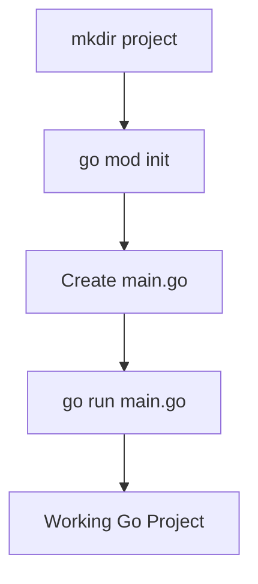
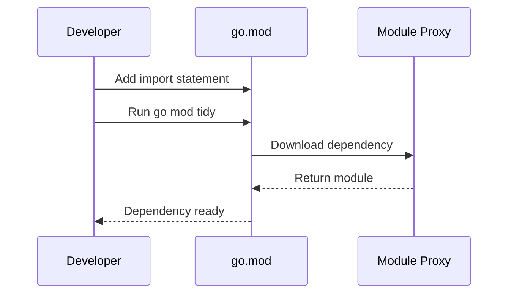

# Setting Up the Go Environment — Junior

<!-- level-focus -->
At junior level, focus on this question:

> How can I apply **Setting Up the Go Environment** in one small example and prove the result?

Use the smallest realistic scenario that exposes the decision and its failure behavior.
## Core Concepts

### Concept 1: Installing Go

Go is distributed as a single archive or installer. You download it from [go.dev/dl](https://go.dev/dl/), extract it, and add the `go` binary to your system PATH. After installation, `go version` confirms it works.

```bash
# Download and install Go (Linux/macOS)
wget https://go.dev/dl/go1.23.0.linux-amd64.tar.gz
sudo rm -rf /usr/local/go
sudo tar -C /usr/local -xzf go1.23.0.linux-amd64.tar.gz
export PATH=$PATH:/usr/local/go/bin
go version
```

### Concept 2: GOPATH vs Go Modules

**GOPATH** was the original workspace model — all Go code lived under one directory (`~/go`). **Go modules** replaced it: each project has its own `go.mod` file, and dependencies are downloaded to a local cache. Always use Go modules for new projects.

### Concept 3: IDE Setup

The two most popular choices are **VS Code with the Go extension** and **GoLand**. VS Code is free and lightweight; GoLand is a paid IDE with deeper Go-specific features. Both provide auto-completion, formatting, linting, and debugging.

### Concept 4: First Project Setup

Creating your first Go project involves making a directory, initializing a module, writing a `.go` file, and running it.

```bash
mkdir myproject && cd myproject
go mod init github.com/username/myproject
# Create main.go, then:
go run main.go
```

---

## Code Examples

### Example 1: Hello World — Your First Go Program

```go
// main.go — the simplest possible Go program
package main

import "fmt"

func main() {
    fmt.Println("Hello, World!")
}
```

**What it does:** Prints "Hello, World!" to the terminal.
**How to run:** `go run main.go`

### Example 2: Creating a Module with a Dependency

```go
// main.go — using an external package
package main

import (
    "fmt"
    "rsc.io/quote"
)

func main() {
    fmt.Println(quote.Hello())
}
```

**Setup steps:**
```bash
mkdir quoteapp && cd quoteapp
go mod init example.com/quoteapp
# Create main.go with the code above, then:
go mod tidy   # downloads the dependency
go run main.go
```

**What it does:** Downloads the `rsc.io/quote` module and prints a greeting.
**How to run:** `go run main.go` (after `go mod tidy`)

### Example 3: Verifying Your Installation

```go
// check_env.go — prints Go environment info
package main

import (
    "fmt"
    "runtime"
)

func main() {
    fmt.Printf("Go Version: %s\n", runtime.Version())
    fmt.Printf("OS/Arch:    %s/%s\n", runtime.GOOS, runtime.GOARCH)
    fmt.Printf("GOROOT:     %s\n", runtime.GOROOT())
    fmt.Printf("NumCPU:     %d\n", runtime.NumCPU())
}
```

**What it does:** Displays Go version, operating system, architecture, and GOROOT.
**How to run:** `go run check_env.go`

---

## Coding Patterns

### Pattern 1: Standard Project Initialization

**Intent:** Create a new Go project with proper module support.
**When to use:** Every time you start a new Go project.

```go
// Step 1: Terminal commands
// mkdir myapp && cd myapp
// go mod init github.com/username/myapp

// Step 2: Create main.go
package main

import "fmt"

func main() {
    fmt.Println("Project initialized successfully!")
}

// Step 3: Run it
// go run main.go
```

**Diagram:**



**Remember:** Always run `go mod init` before writing any Go code in a new directory.

---

### Pattern 2: Adding Dependencies

**Intent:** Import and use third-party packages in your project.

```go
// After adding an import to your .go file:
// go mod tidy
// This downloads missing dependencies and removes unused ones
package main

import (
    "fmt"
    "github.com/fatih/color"
)

func main() {
    color.Green("This text is green!")
    fmt.Println("Dependencies are working!")
}
```

**Diagram:**



---

## Best Practices

- **Use Go modules for every project** — never rely on GOPATH for new code
- **Pin your Go version** — document the required Go version in your README or `go.mod`
- **Run `go mod tidy` regularly** — keeps your `go.mod` and `go.sum` clean
- **Use `go vet ./...` before committing** — catches common mistakes automatically
- **Format your code with `gofmt` or `goimports`** — enforces the standard Go style

---

## Edge Cases & Pitfalls

### Pitfall 1: Multiple Go Installations

```bash
# You might have Go installed via package manager AND manually
which -a go
# Output:
# /usr/local/go/bin/go
# /usr/bin/go    <-- old version from package manager
```

**What happens:** The wrong version of Go may be used, causing confusing build errors.
**How to fix:** Remove the old installation or adjust your PATH to prioritize the correct one.

### Pitfall 2: GOPATH and Modules Conflict

```bash
# If GO111MODULE is set to "off", modules are disabled
go env GO111MODULE
# Should output: "" or "on"
```

**What happens:** Go ignores your `go.mod` file and looks for packages in GOPATH.
**How to fix:** `go env -w GO111MODULE=on`

---

## Common Mistakes

### Mistake 1: Not Running `go mod tidy`

```bash
# Wrong — manually editing go.mod
echo 'require github.com/pkg/errors v0.9.1' >> go.mod

# Correct — let Go manage dependencies
go mod tidy
```

### Mistake 2: Forgetting `package main` and `func main()`

```go
// Wrong — missing package declaration
import "fmt"

func main() {
    fmt.Println("Hello")
}

// Correct — every executable needs package main
package main

import "fmt"

func main() {
    fmt.Println("Hello")
}
```

### Mistake 3: Wrong Module Path

```bash
# Wrong — generic module path
go mod init myapp

# Correct — use a unique, URL-like path
go mod init github.com/username/myapp
```

---

## Common Misconceptions

### Misconception 1: "I need to set GOPATH for Go modules to work"

**Reality:** Go modules do NOT require GOPATH. Since Go 1.16, modules are the default. GOPATH is only used as a cache location (`~/go/pkg/mod`).

**Why people think this:** Older tutorials and blog posts (pre-2019) heavily relied on GOPATH because modules did not exist yet.

### Misconception 2: "I need GoLand to write Go — VS Code is not enough"

**Reality:** VS Code with the official Go extension provides excellent Go support including auto-completion, debugging, test running, and refactoring. GoLand offers some additional features, but VS Code is fully sufficient.

**Why people think this:** GoLand's marketing and its Java IDE heritage make it seem like the "serious" option.

---

## Tricky Points

### Tricky Point 1: `go install` vs `go build`

```bash
# go build — creates binary in current directory
go build -o myapp .

# go install — creates binary in $GOPATH/bin or $GOBIN
go install .
```

**Why it's tricky:** Both compile code, but the output goes to different places.
**Key takeaway:** Use `go build` for project binaries, `go install` for tools you want globally available.

### Tricky Point 2: Module Path Must Match Repository

```bash
# If your repo is github.com/alice/mylib, your go.mod must say:
# module github.com/alice/mylib
# NOT: module mylib
```

**Why it's tricky:** Go uses the module path to resolve imports. A mismatch means `go get` fails for users of your library.
**Key takeaway:** Always use the full repository URL as your module path.

---

## "What If?" Scenarios

**What if you have Go 1.20 installed but your project's `go.mod` says `go 1.22`?**
- **You might think:** The project will not build at all.
- **But actually:** Go is forward-compatible for the `go` directive. Go 1.20 will attempt to build the project but may fail if the code uses features introduced in Go 1.22. The `go` directive in `go.mod` is a minimum version, not a strict requirement (though since Go 1.21, toolchain management can auto-download the right version).

---

## Apply it

1. Choose one small, known input for **Setting Up the Go Environment**.
2. Predict the output or observable behavior.
3. Run the smallest example or probe that exercises the concept.
4. Change one input to trigger a failure or boundary case.
5. Explain the evidence using the guide's vocabulary.

## Verify your work

- Record the exact input, command or code path, and output.
- Repeat the probe and confirm the result is consistent.
- Show one expected success and one expected failure.
- Resolve any difference between the prediction and the evidence.

## Review questions

- What problem does Setting Up the Go Environment solve in the example?
- Which input changes the observed result, and why?
- What is the smallest useful success check?
- Which beginner mistake would your evidence catch?
