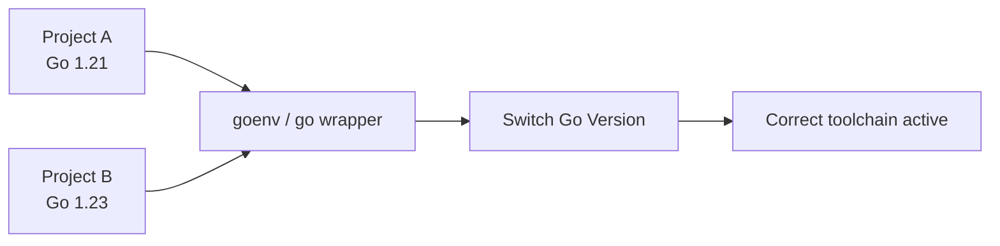
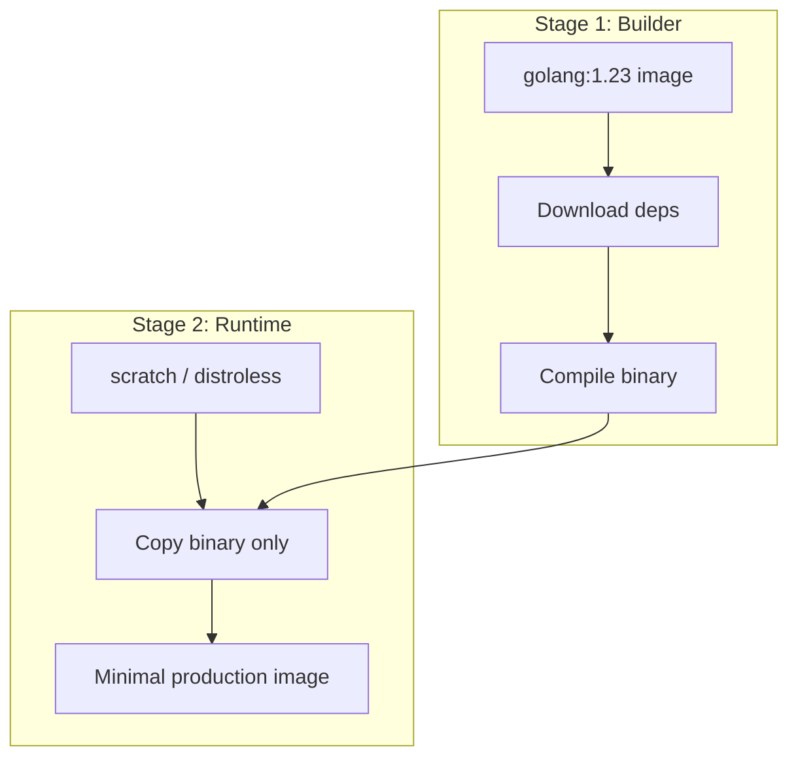
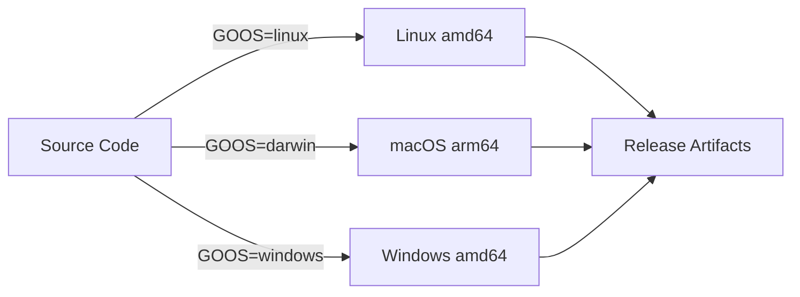

# Setting Up the Go Environment — Middle

<!-- level-focus -->
At middle level, focus on this question:

> Where does **Setting Up the Go Environment** belong in a maintainable component, and which trade-off selects the design?

Use the smallest realistic scenario that exposes the decision and its failure behavior.
## Core Concepts

### Concept 1: Multi-Version Management

In production teams you often need different Go versions for different projects. Tools like `goenv`, `gvm`, or the built-in `go install golang.org/dl/go1.21.0@latest` command let you switch between versions.

```bash
# Using the official Go wrapper approach
go install golang.org/dl/go1.22.0@latest
go1.22.0 download
go1.22.0 version  # go version go1.22.0 linux/amd64

# Using goenv
goenv install 1.23.0
goenv local 1.23.0    # set version for current directory
goenv global 1.22.0   # set default version
```



### Concept 2: Workspace Configuration

Go 1.18 introduced **workspaces** (`go.work`) for developing multiple related modules simultaneously without publishing them.

```bash
# Create a workspace for multi-module development
go work init ./api ./shared ./worker
```

```go
// go.work file
go 1.23

use (
    ./api
    ./shared
    ./worker
)
```

### Concept 3: CI/CD Setup for Go

A production CI/CD pipeline for Go should include linting, testing with race detection, building, and security scanning.

```yaml
# .github/workflows/go.yml
name: Go CI
on: [push, pull_request]
jobs:
  build:
    runs-on: ubuntu-latest
    steps:
      - uses: actions/checkout@v4
      - uses: actions/setup-go@v5
        with:
          go-version: '1.23'
      - run: go vet ./...
      - run: go test -race -coverprofile=coverage.out ./...
      - run: go build -o app ./cmd/server
      - name: golangci-lint
        uses: golangci/golangci-lint-action@v4
        with:
          version: latest
```

### Concept 4: Docker-Based Development

Docker standardizes the development environment across the team and eliminates "works on my machine" issues.

```dockerfile
# Dockerfile.dev — development container
FROM golang:1.23-bookworm

RUN go install github.com/air-verse/air@latest
RUN go install github.com/go-delve/delve/cmd/dlv@latest

WORKDIR /app
COPY go.mod go.sum ./
RUN go mod download

COPY . .
CMD ["air", "-c", ".air.toml"]
```

### Concept 5: Build Tags

Build tags let you include or exclude files during compilation — useful for platform-specific code, feature flags, or testing.

```go
//go:build integration

package myapp_test

import "testing"

func TestIntegration(t *testing.T) {
    // This test only runs when: go test -tags=integration ./...
    t.Log("Running integration test")
}
```

### Concept 6: Cross-Compilation

Go makes cross-compilation trivial — set `GOOS` and `GOARCH` environment variables.

```bash
# Build for Linux from macOS
GOOS=linux GOARCH=amd64 go build -o server-linux ./cmd/server

# Build for Windows
GOOS=windows GOARCH=amd64 go build -o server.exe ./cmd/server

# Build for ARM (Raspberry Pi)
GOOS=linux GOARCH=arm64 go build -o server-arm ./cmd/server
```

---

## Evolution & Historical Context

**Before Go modules (pre-2019):**
- All Go code lived under `$GOPATH/src/`
- Dependency management was chaotic — tools like `dep`, `glide`, and `godep` competed
- No version pinning by default — `go get` always fetched the latest code
- Reproducible builds were nearly impossible without vendoring

**How Go modules changed things:**
- Each project is self-contained with `go.mod` and `go.sum`
- Semantic versioning is enforced
- The module proxy (`proxy.golang.org`) caches dependencies for reliability
- Checksum database (`sum.golang.org`) ensures integrity
- `go.work` added workspace support for multi-module development

---

## Alternative Approaches (Plan B)

| Alternative | How it works | When you might be forced to use it |
|-------------|--------------|-------------------------------------|
| **Nix / devbox** | Declarative environment with pinned packages | When Docker overhead is too high and you need reproducibility |
| **asdf** | Universal version manager for multiple languages | When your team uses Go, Python, Node and wants one tool |

---

## Code Examples

### Example 1: Production Makefile

```makefile
# Makefile for a production Go project
.PHONY: build test lint clean docker

BINARY=server
VERSION=$(shell git describe --tags --always --dirty)
LDFLAGS=-ldflags "-X main.version=$(VERSION) -s -w"

build:
	CGO_ENABLED=0 go build $(LDFLAGS) -o $(BINARY) ./cmd/server

test:
	go test -race -coverprofile=coverage.out ./...
	go tool cover -func=coverage.out

lint:
	golangci-lint run ./...
	go vet ./...

clean:
	rm -f $(BINARY) coverage.out

docker:
	docker build -t myapp:$(VERSION) .

cross:
	GOOS=linux GOARCH=amd64 go build $(LDFLAGS) -o $(BINARY)-linux-amd64 ./cmd/server
	GOOS=darwin GOARCH=arm64 go build $(LDFLAGS) -o $(BINARY)-darwin-arm64 ./cmd/server
	GOOS=windows GOARCH=amd64 go build $(LDFLAGS) -o $(BINARY)-windows-amd64.exe ./cmd/server
```

**Why this pattern:** A Makefile centralizes all build, test, and deployment commands for consistency.
**Trade-offs:** Requires `make` installed; alternatively use [task](https://taskfile.dev/) or [mage](https://magefile.org/) for pure-Go alternatives.

### Example 2: Build Tags for Feature Flags

```go
// feature_premium.go
//go:build premium

package features

func GetPlanName() string {
    return "Premium"
}
```

```go
// feature_free.go
//go:build !premium

package features

func GetPlanName() string {
    return "Free"
}
```

```bash
# Build free version (default)
go build -o app-free ./cmd/app

# Build premium version
go build -tags=premium -o app-premium ./cmd/app
```

**When to use which:** Build tags for compile-time feature selection; environment variables for runtime configuration.

---

## Coding Patterns

### Pattern 1: Multi-Stage Build Pattern

**Category:** Idiomatic / Deployment
**Intent:** Produce minimal Docker images for Go applications.
**When to use:** Every time you deploy a Go app in a container.
**When NOT to use:** During development — use a full Go image instead.

**Structure diagram:**



**Implementation:**

```dockerfile
# Multi-stage Dockerfile
FROM golang:1.23-bookworm AS builder
WORKDIR /app
COPY go.mod go.sum ./
RUN go mod download
COPY . .
RUN CGO_ENABLED=0 GOOS=linux go build -ldflags="-s -w" -o /server ./cmd/server

FROM gcr.io/distroless/static-debian12:nonroot
COPY --from=builder /server /server
ENTRYPOINT ["/server"]
```

**Trade-offs:**

| Pros | Cons |
|---------|---------|
| Final image is 5-15 MB instead of 800+ MB | Cannot shell into the container for debugging |
| Reduced attack surface | Must use multi-stage approach consistently |

---

### Pattern 2: Cross-Compilation Matrix

**Intent:** Build binaries for all target platforms in a single workflow.



```go
// build.go — build script using os/exec
package main

import (
    "fmt"
    "os"
    "os/exec"
)

type Target struct {
    OS   string
    Arch string
}

func main() {
    targets := []Target{
        {"linux", "amd64"},
        {"linux", "arm64"},
        {"darwin", "arm64"},
        {"windows", "amd64"},
    }

    for _, t := range targets {
        output := fmt.Sprintf("bin/app-%s-%s", t.OS, t.Arch)
        if t.OS == "windows" {
            output += ".exe"
        }

        cmd := exec.Command("go", "build", "-o", output, "./cmd/app")
        cmd.Env = append(os.Environ(),
            "GOOS="+t.OS,
            "GOARCH="+t.Arch,
            "CGO_ENABLED=0",
        )
        cmd.Stdout = os.Stdout
        cmd.Stderr = os.Stderr

        fmt.Printf("Building %s/%s...\n", t.OS, t.Arch)
        if err := cmd.Run(); err != nil {
            fmt.Fprintf(os.Stderr, "build failed for %s/%s: %v\n", t.OS, t.Arch, err)
            os.Exit(1)
        }
    }
    fmt.Println("All builds complete!")
}
```

---

## Best Practices

- **Pin Go version in CI** — match the version in `go.mod` exactly to avoid surprises
- **Cache dependencies in CI** — cache `~/.cache/go-build` and `~/go/pkg/mod` for faster builds
- **Use `golangci-lint`** — runs 50+ linters in one pass, faster than running each separately
- **Commit `go.sum`** — it ensures reproducible builds; never `.gitignore` it
- **Use multi-stage Docker builds** — reduces image size from 800+ MB to 5-15 MB

---

## Edge Cases & Pitfalls

### Pitfall 1: CGo Breaks Cross-Compilation

```bash
# This works:
GOOS=linux GOARCH=amd64 go build -o app .

# This fails if your code uses CGo:
GOOS=linux GOARCH=arm64 go build -o app .
# Error: cannot cross-compile when CGO is enabled
```

**Impact:** Your cross-compilation workflow breaks silently.
**Detection:** Set `CGO_ENABLED=0` explicitly in your build scripts.
**Fix:** Either disable CGo (`CGO_ENABLED=0`) or set up a proper C cross-compiler toolchain.

### Pitfall 2: Private Module Authentication

```bash
# go mod tidy fails for private repos
go mod tidy
# Error: reading github.com/company/private-lib: 410 Gone

# Fix: configure GOPRIVATE
go env -w GOPRIVATE=github.com/company/*
# And set up git authentication:
git config --global url."https://${GITHUB_TOKEN}@github.com/".insteadOf "https://github.com/"
```

---

## Common Mistakes

### Mistake 1: Not Using `CGO_ENABLED=0` for Containers

```bash
# Looks correct but produces dynamically linked binary
go build -o app ./cmd/server
# Fails in scratch/distroless containers with:
# exec: "app": executable file not found

# Properly handles static linking
CGO_ENABLED=0 go build -o app ./cmd/server
```

**Why it's wrong:** Without `CGO_ENABLED=0`, Go may link against libc, which is not available in minimal containers.

### Mistake 2: Ignoring go.sum in Version Control

```gitignore
# Wrong .gitignore
go.sum

# Correct — never ignore go.sum
# go.sum ensures reproducible builds with verified checksums
```

---

## Common Misconceptions

### Misconception 1: "Go modules and GOPATH cannot coexist"

**Reality:** They coexist. Go modules is the default mode since Go 1.16, but GOPATH still exists as the default location for `go install` binaries (`$GOPATH/bin`) and the module cache (`$GOPATH/pkg/mod`).

**Evidence:**
```bash
go env GOPATH    # /home/user/go (still exists and used)
go env GOMODCACHE # /home/user/go/pkg/mod (inside GOPATH)
```

### Misconception 2: "Cross-compilation always just works with GOOS/GOARCH"

**Reality:** It works perfectly for pure Go code. But if any dependency uses CGo (imports "C"), cross-compilation requires a C cross-compiler or disabling CGo with `CGO_ENABLED=0`.

**Why this matters:** Packages like `go-sqlite3` use CGo. If you import them, your simple `GOOS=linux go build` will fail.

---

## Anti-Patterns

### Anti-Pattern 1: God Makefile

```makefile
# The Anti-Pattern — one massive Makefile target that does everything
all:
    go mod tidy && go vet ./... && go test ./... && \
    CGO_ENABLED=0 go build -o app && docker build -t app . && \
    docker push app:latest && kubectl apply -f deploy.yaml
```

**Why it's bad:** No granularity, hard to debug failures, no parallelism.
**The refactoring:** Split into separate targets (`lint`, `test`, `build`, `docker`, `deploy`).

### Anti-Pattern 2: Hardcoded Go Version Everywhere

```dockerfile
# Version hardcoded in 5 different places:
# Dockerfile, CI config, Makefile, README, go.mod
FROM golang:1.22   # hardcoded
```

**Why it's bad:** Version drift — updating requires finding and changing every occurrence.
**The refactoring:** Use `.go-version` file as the single source of truth; read from it in CI/Docker.

---

## Tricky Points

### Tricky Point 1: `go.mod` `go` Directive Semantics Changed

```go
// go.mod
module myapp
go 1.21
```

**What actually happens:** Since Go 1.21, the `go` directive acts as a **minimum required version**. If you have Go 1.20 installed and the module says `go 1.21`, the toolchain will attempt to download Go 1.21 automatically (if `GOTOOLCHAIN` is set to `auto`).
**Why:** The Go team added "toolchain management" in Go 1.21 to solve version mismatch issues.

### Tricky Point 2: Build Tags Syntax Changed

```go
// Old syntax (before Go 1.17)
// +build linux,amd64

// New syntax (Go 1.17+)
//go:build linux && amd64
```

**What actually happens:** Both syntaxes work, but `gofmt` will add the new `//go:build` line if you only have the old `// +build` line. In new code, always use the `//go:build` syntax.

---

## Comparison with Other Languages

| Aspect | Go | Python | Java | Rust |
|--------|-----|--------|------|------|
| Version management | goenv, go wrapper | pyenv, conda | SDKMAN | rustup |
| Dependency file | go.mod / go.sum | requirements.txt / pyproject.toml | pom.xml / build.gradle | Cargo.toml / Cargo.lock |
| Cross-compilation | Built-in (GOOS/GOARCH) | Not native | JVM handles it | Built-in via rustup target |
| Build tool | `go build` (built-in) | setuptools/pip | Maven/Gradle | Cargo |
| Docker image size | 5-15 MB (scratch) | 50-200 MB | 100-300 MB | 5-15 MB (scratch) |

### Key differences:
- **Go vs Python:** Go produces a single static binary; Python requires a runtime and all dependencies at runtime
- **Go vs Java:** Go compiles to native code; Java needs a JVM, making images larger
- **Go vs Rust:** Similar small binaries, but Rust cross-compilation requires per-target setup via `rustup target add`

---

## Apply it

1. Find a real component where **Setting Up the Go Environment** affects an interface or dependency.
2. Write two plausible choices and the constraint that favors each one.
3. Make the smallest reversible change at that boundary.
4. Exercise the component alone, then exercise the integrated flow.
5. Keep the decision note with the evidence that selected the option.

## Verify your work

- A focused check proves the local behavior.
- An integrated check proves callers and dependencies still agree.
- Logs, traces, compiler output, or benchmarks expose the boundary.
- Reverting the change restores the previous behavior without unrelated edits.

## Review questions

- Which boundary is most affected by Setting Up the Go Environment?
- What constraint would make you choose the alternative design?
- How would you isolate a local defect from an integration defect?
- What evidence shows that the change remains maintainable?
