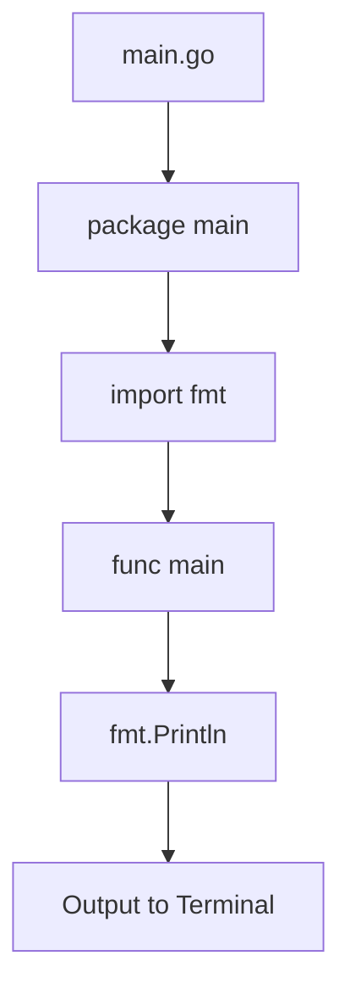
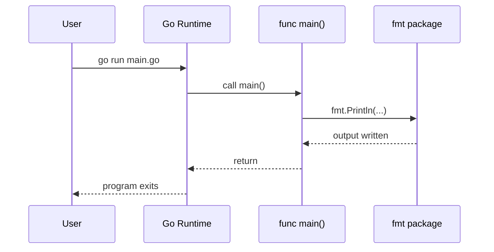

# Hello World in Go — Junior

<!-- level-focus -->
At junior level, focus on this question:

> How can I apply **Hello World in Go** in one small example and prove the result?

Use the smallest realistic scenario that exposes the decision and its failure behavior.
## Core Concepts

### Concept 1: Package Declaration

Every Go file must start with a `package` declaration. For executable programs, this must be `package main`. Library code uses other package names like `package math` or `package http`.

```go
package main // This file is part of an executable program
```

### Concept 2: Import Statement

The `import` statement brings in packages you want to use. The `fmt` package provides functions for formatted I/O, including `Println` for printing text.

```go
import "fmt" // Now we can use fmt.Println, fmt.Printf, etc.
```

### Concept 3: The main Function

`func main()` is the entry point of every Go executable. It takes no arguments and returns nothing. When your program starts, Go calls this function first.

```go
func main() {
    // Your program logic goes here
}
```

### Concept 4: fmt.Println

`fmt.Println` prints its arguments to standard output (the terminal) followed by a newline character. The capital `P` means it is an exported (public) function from the `fmt` package.

```go
fmt.Println("Hello, World!") // Prints: Hello, World!
```

---

## Code Examples

### Example 1: Classic Hello World

```go
// Every Go file starts with a package declaration.
// "main" means this is an executable program.
package main

// Import the "fmt" package for formatted I/O functions.
import "fmt"

// func main() is where the program begins execution.
func main() {
    // Println prints the string and adds a newline at the end.
    fmt.Println("Hello, World!")
}
```

**What it does:** Prints `Hello, World!` to the terminal and exits.
**How to run:** `go run main.go`
**How to build:** `go build -o hello main.go` then `./hello`

### Example 2: Printing Multiple Values

```go
package main

import "fmt"

func main() {
    // Println can accept multiple arguments, separated by spaces in output
    fmt.Println("Hello", "from", "Go!")
    // Output: Hello from Go!
}
```

**What it does:** Demonstrates that `Println` accepts multiple arguments and separates them with spaces.
**How to run:** `go run main.go`

### Example 3: Using Printf for Formatted Output

```go
package main

import "fmt"

func main() {
    name := "Gopher"
    age := 10
    // Printf uses format verbs: %s for string, %d for integer
    fmt.Printf("Hello, %s! You are %d years old.\n", name, age)
    // Output: Hello, Gopher! You are 10 years old.
}
```

**What it does:** Shows formatted output using `Printf` with format verbs.
**How to run:** `go run main.go`

### Example 4: Print Without Newline

```go
package main

import "fmt"

func main() {
    // Print does NOT add a newline at the end
    fmt.Print("Hello, ")
    fmt.Print("World!")
    fmt.Println() // Add a newline manually
    // Output: Hello, World!
}
```

**What it does:** Shows the difference between `Print` (no newline) and `Println` (adds newline).
**How to run:** `go run main.go`

---

## Coding Patterns

### Pattern 1: Single Import

**Intent:** Import one package for a simple program.
**When to use:** When your program only needs one external package.

```go
package main

import "fmt"

func main() {
    fmt.Println("Single import pattern")
}
```

**Diagram:**



**Remember:** Every Go program needs at least `package main` and `func main()` to be executable.

---

### Pattern 2: Multiple Imports (Grouped)

**Intent:** Import multiple packages cleanly using parentheses.
**When to use:** When your program uses more than one package.

```go
package main

import (
    "fmt"
    "os"
)

func main() {
    fmt.Println("Program name:", os.Args[0])
}
```

**Diagram:**



**Remember:** Use grouped imports with parentheses — Go's `goimports` tool will organize them automatically.

---

## Best Practices

- **Always start with `package main`:** Executable Go programs must use the `main` package.
- **Use `goimports` or `gofmt`:** Let Go tools format your code automatically — run `gofmt -w main.go`.
- **Keep `func main()` small:** Move logic into separate functions; `main` should just wire things together.
- **Use grouped imports:** When importing more than one package, use parenthesized import blocks.
- **Run `go vet` on your code:** It catches common mistakes like incorrect format verbs in `Printf`.

---

## Edge Cases & Pitfalls

### Pitfall 1: Missing Newline at End of File

```go
package main

import "fmt"

func main() {
    fmt.Println("Hello")
}// No newline here — some editors warn about this
```

**What happens:** The code compiles fine, but some tools and code review systems flag missing trailing newlines.
**How to fix:** Always ensure your file ends with a newline character. Most editors do this automatically.

### Pitfall 2: Wrong File Extension

Saving your code as `main.txt` instead of `main.go` will cause `go run` to fail.

**How to fix:** Always use the `.go` file extension.

---

## Common Mistakes

### Mistake 1: Lowercase function name in fmt

```go
package main

import "fmt"

func main() {
    fmt.println("Hello") // Error: cannot refer to unexported name fmt.println
}

// Correct: use capital P
func main() {
    fmt.Println("Hello")
}
```

### Mistake 2: Using curly brace on a new line

```go
package main

import "fmt"

func main()
{ // Error: unexpected semicolon or newline before {
    fmt.Println("Hello")
}

// Correct: opening brace on the same line
func main() {
    fmt.Println("Hello")
}
```

### Mistake 3: Semicolons at end of lines

```go
package main

import "fmt"

func main() {
    fmt.Println("Hello"); // Works but not idiomatic Go
}

// Correct: no semicolons — Go inserts them automatically
func main() {
    fmt.Println("Hello")
}
```

---

## Common Misconceptions

### Misconception 1: "Go needs semicolons like C/Java"

**Reality:** Go automatically inserts semicolons at the end of lines during compilation. You should NOT write them manually.

**Why people think this:** Developers coming from C, Java, or JavaScript are used to writing semicolons. Go's lexer handles this for you.

### Misconception 2: "`go run` creates a permanent binary"

**Reality:** `go run` creates a temporary binary in a temp directory, runs it, and deletes it after execution. Use `go build` to create a permanent binary.

**Why people think this:** Because `go run` works so seamlessly, people assume it is the same as `go build` + run.

---

## Tricky Points

### Tricky Point 1: Opening Brace Placement

```go
package main

import "fmt"

// This will NOT compile:
func main()
{
    fmt.Println("Hello")
}
```

**Why it's tricky:** Go's automatic semicolon insertion adds a semicolon after `main()`, making it `func main();` — which is invalid syntax.
**Key takeaway:** Always put the opening `{` on the same line as the function declaration.

### Tricky Point 2: Exported vs Unexported Names

```go
package main

import "fmt"

func main() {
    fmt.Println("Works")  // Println starts with uppercase — exported
    // fmt.println("Fails") // lowercase — unexported, compile error
}
```

**Why it's tricky:** In Go, capitalization determines visibility. Only names starting with an uppercase letter are accessible from outside their package.
**Key takeaway:** When calling functions from imported packages, the function name must start with a capital letter.

---

## "What If?" Scenarios

**What if you forget `package main`?**
- **You might think:** The compiler will use a default package name.
- **But actually:** The Go compiler will report an error. Every `.go` file must declare its package. Without `package main`, the file cannot be an executable.

**What if you write `func Main()` (capital M)?**
- **You might think:** Go is case-insensitive, so it would still work.
- **But actually:** Go is case-sensitive. `Main` is not the same as `main`. The runtime looks for `func main()` (lowercase) — your program will fail to compile with `runtime.main_main·f: function main is undeclared in the main package`.

---

## Apply it

1. Choose one small, known input for **Hello World in Go**.
2. Predict the output or observable behavior.
3. Run the smallest example or probe that exercises the concept.
4. Change one input to trigger a failure or boundary case.
5. Explain the evidence using the guide's vocabulary.

## Verify your work

- Record the exact input, command or code path, and output.
- Repeat the probe and confirm the result is consistent.
- Show one expected success and one expected failure.
- Resolve any difference between the prediction and the evidence.

## Review questions

- What problem does Hello World in Go solve in the example?
- Which input changes the observed result, and why?
- What is the smallest useful success check?
- Which beginner mistake would your evidence catch?
