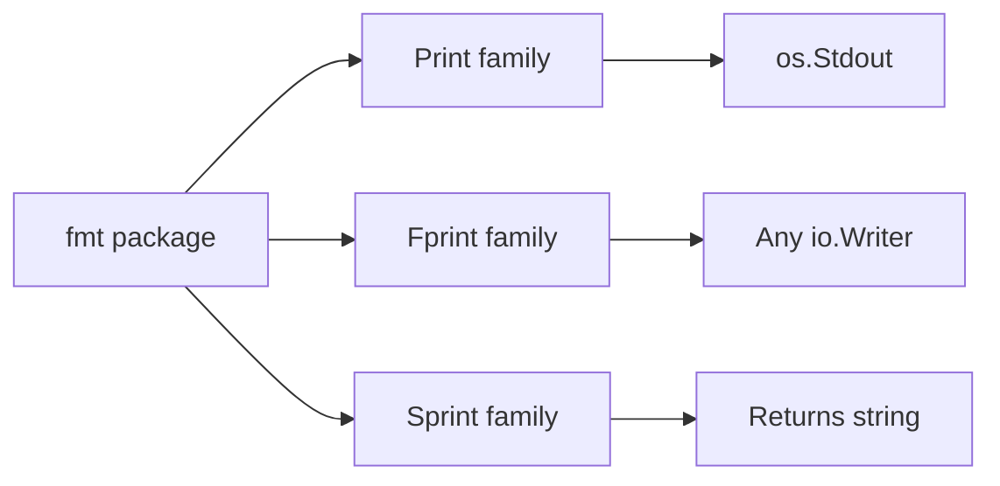
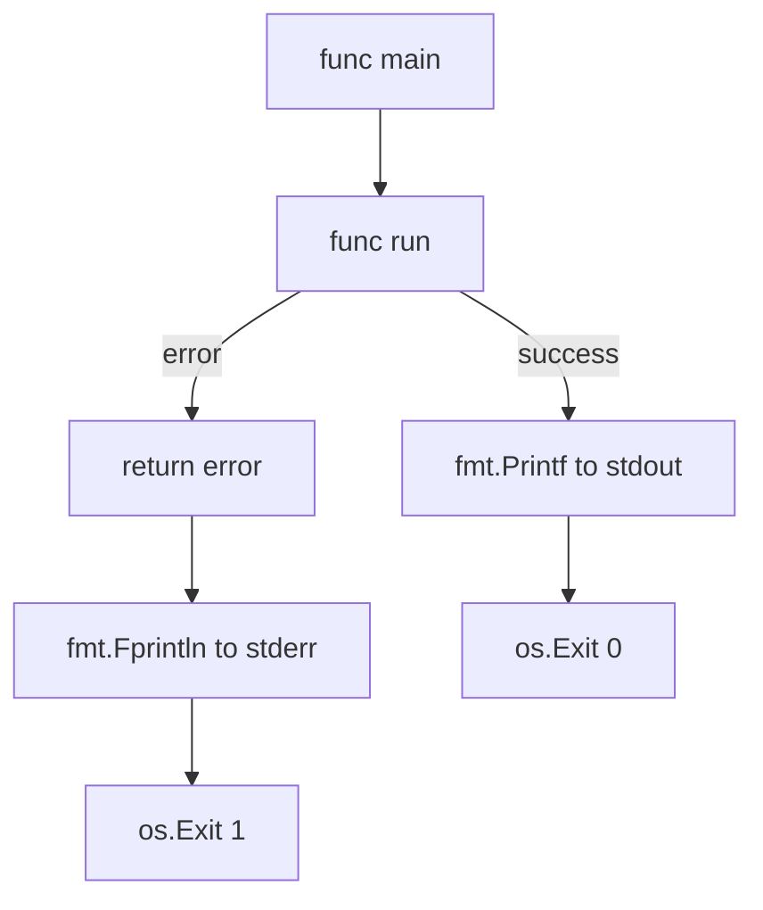
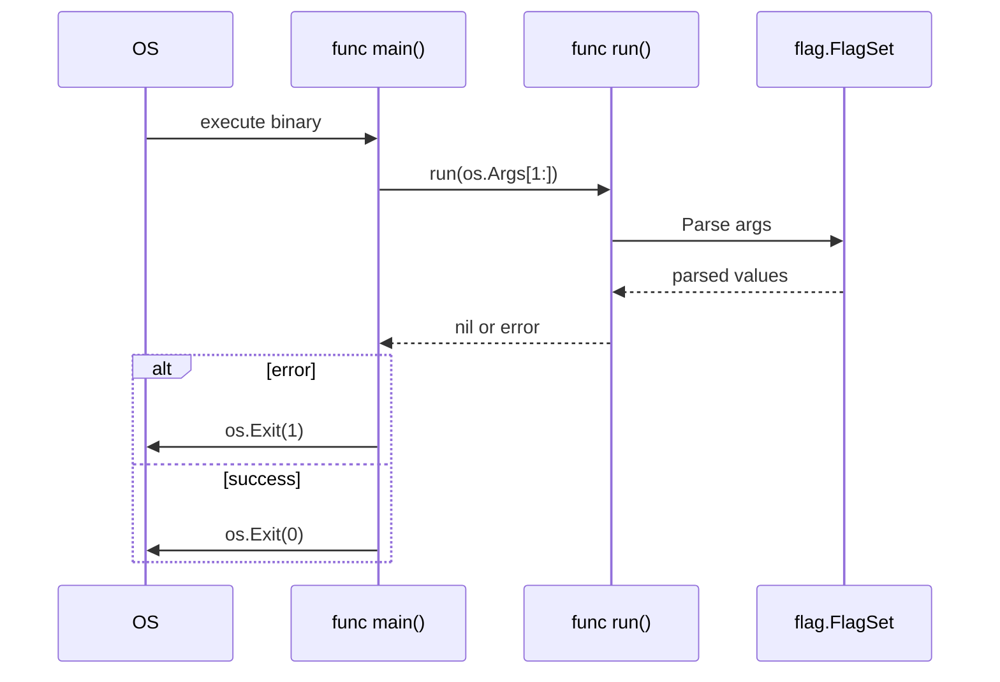
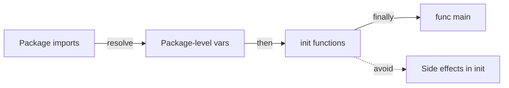

# Hello World in Go — Middle

<!-- level-focus -->
At middle level, focus on this question:

> Where does **Hello World in Go** belong in a maintainable component, and which trade-off selects the design?

Use the smallest realistic scenario that exposes the decision and its failure behavior.
## Core Concepts

### Concept 1: The `fmt` Package Deep Dive

The `fmt` package implements formatted I/O analogous to C's `printf` and `scanf`. It provides three families of functions:

- **Print family:** `Print`, `Println`, `Printf` — write to `os.Stdout`
- **Fprint family:** `Fprint`, `Fprintln`, `Fprintf` — write to any `io.Writer`
- **Sprint family:** `Sprint`, `Sprintln`, `Sprintf` — return a `string` instead of writing



Each function uses Go's reflection to format values based on their types. Format verbs (`%v`, `%s`, `%d`, `%+v`, `%#v`) give you fine-grained control.

### Concept 2: Standard I/O Streams

Go exposes three standard streams via the `os` package: `os.Stdin`, `os.Stdout`, and `os.Stderr`. Understanding these is critical for building CLI tools.

```go
package main

import (
    "fmt"
    "os"
)

func main() {
    fmt.Fprintln(os.Stdout, "This is standard output")
    fmt.Fprintln(os.Stderr, "This is standard error")
}
```

- `os.Stdout` — normal program output (can be piped: `./app | grep ...`)
- `os.Stderr` — error messages and diagnostics (not captured by pipes by default)
- `os.Stdin` — input from the user or piped data

### Concept 3: Command-Line Arguments with `os.Args`

`os.Args` is a string slice that contains command-line arguments. `os.Args[0]` is the program name.

```go
package main

import (
    "fmt"
    "os"
)

func main() {
    fmt.Println("Program:", os.Args[0])
    if len(os.Args) > 1 {
        fmt.Println("Arguments:", os.Args[1:])
    }
}
```

### Concept 4: The `flag` Package

For structured argument parsing, Go provides the `flag` package. It handles typed flags, defaults, and usage messages.

```go
package main

import (
    "flag"
    "fmt"
)

func main() {
    name := flag.String("name", "World", "who to greet")
    loud := flag.Bool("loud", false, "use uppercase")
    flag.Parse()

    greeting := fmt.Sprintf("Hello, %s!", *name)
    if *loud {
        greeting = fmt.Sprintf("HELLO, %s!", *name)
    }
    fmt.Println(greeting)
}
```

Run: `go run main.go -name=Gopher -loud`

### Concept 5: The `init()` Function

The `init()` function runs before `main()`. Each file can have multiple `init()` functions. They execute in the order they are declared, after all package-level variables are initialized.

```go
package main

import "fmt"

var config string

func init() {
    config = "production"
    fmt.Println("init: config set to", config)
}

func main() {
    fmt.Println("main: running in", config, "mode")
}
// Output:
// init: config set to production
// main: running in production mode
```

---

## Evolution & Historical Context

**Before Go (2009):**
- C programs required `#include <stdio.h>` and `printf` with manual format strings — no type safety
- Java required a full class with `public static void main(String[] args)` — excessive boilerplate
- Python needed only `print("Hello")` — but no compilation step and no static typing

**How Go changed things:**
- Minimal boilerplate: `package main`, `import "fmt"`, `func main()` — three lines of scaffolding
- Type-safe formatting via `fmt.Printf` with compile-time checks (via `go vet`)
- Single binary output with no runtime dependencies — a fundamental shift from interpreted languages
- Automatic code formatting with `gofmt` — ended style debates before they started

---

## Alternative Approaches (Plan B)

| Alternative | How it works | When you might be forced to use it |
|-------------|--------------|------------------------------------|
| **`os.Stdout.Write([]byte)`** | Direct byte-level I/O bypassing `fmt` | When you need zero-allocation output in performance-critical code |
| **`log` package** | Adds timestamps and prefixes automatically | When you need structured output with timestamps for production logging |

---

## Code Examples

### Example 1: Production-Ready Greeting Tool

```go
package main

import (
    "flag"
    "fmt"
    "os"
    "strings"
)

func main() {
    name := flag.String("name", "", "name to greet (required)")
    upper := flag.Bool("upper", false, "output in uppercase")
    flag.Parse()

    if *name == "" {
        fmt.Fprintln(os.Stderr, "error: -name flag is required")
        flag.Usage()
        os.Exit(1)
    }

    greeting := fmt.Sprintf("Hello, %s!", *name)
    if *upper {
        greeting = strings.ToUpper(greeting)
    }
    fmt.Println(greeting)
}
```

**Why this pattern:** Validates required flags, writes errors to stderr, uses proper exit codes.
**Trade-offs:** More code than a simple `Println`, but handles real-world input correctly.

### Example 2: Formatted Output with Multiple Format Verbs

```go
package main

import "fmt"

type Server struct {
    Host string
    Port int
}

func main() {
    s := Server{Host: "localhost", Port: 8080}

    fmt.Printf("Default:  %v\n", s)   // {localhost 8080}
    fmt.Printf("Verbose:  %+v\n", s)  // {Host:localhost Port:8080}
    fmt.Printf("Go repr:  %#v\n", s)  // main.Server{Host:"localhost", Port:8080}
    fmt.Printf("Type:     %T\n", s)   // main.Server
    fmt.Printf("Address:  %s:%d\n", s.Host, s.Port) // localhost:8080
}
```

**When to use which:** `%v` for logging, `%+v` for debugging, `%#v` for Go-syntax representation, `%T` for type inspection.

### Example 3: Reading Input from Stdin

```go
package main

import (
    "bufio"
    "fmt"
    "os"
    "strings"
)

func main() {
    reader := bufio.NewReader(os.Stdin)
    fmt.Print("Enter your name: ")
    input, err := reader.ReadString('\n')
    if err != nil {
        fmt.Fprintf(os.Stderr, "error reading input: %v\n", err)
        os.Exit(1)
    }
    name := strings.TrimSpace(input)
    fmt.Printf("Hello, %s!\n", name)
}
```

---

## Coding Patterns

### Pattern 1: Stderr for Errors, Stdout for Output

**Category:** Idiomatic
**Intent:** Separate normal output from error messages so piping and redirection work correctly.
**When to use:** Every CLI tool that outputs data.
**When NOT to use:** Libraries (they should return errors, not print them).

```go
package main

import (
    "fmt"
    "os"
)

func run() error {
    if len(os.Args) < 2 {
        return fmt.Errorf("usage: %s <name>", os.Args[0])
    }
    fmt.Printf("Hello, %s!\n", os.Args[1]) // stdout — normal output
    return nil
}

func main() {
    if err := run(); err != nil {
        fmt.Fprintln(os.Stderr, "error:", err) // stderr — errors
        os.Exit(1)
    }
}
```

**Diagram:**



**Trade-offs:**

| Pros | Cons |
|---------|---------|
| Output can be piped safely | Requires discipline to use Fprintln for errors |
| Errors visible even when stdout is redirected | Slightly more code than just fmt.Println everywhere |

---

### Pattern 2: The `run() error` Pattern

**Category:** Idiomatic Go
**Intent:** Keep `main()` thin — delegate all logic to a testable `run` function.

```go
package main

import (
    "flag"
    "fmt"
    "os"
)

func run(args []string) error {
    fs := flag.NewFlagSet("greet", flag.ContinueOnError)
    name := fs.String("name", "World", "who to greet")
    if err := fs.Parse(args); err != nil {
        return err
    }
    fmt.Printf("Hello, %s!\n", *name)
    return nil
}

func main() {
    if err := run(os.Args[1:]); err != nil {
        fmt.Fprintln(os.Stderr, err)
        os.Exit(1)
    }
}
```

**Diagram:**



---

### Pattern 3: init() for Configuration

**Category:** Idiomatic Go
**Intent:** Initialize package-level state before main runs.



```go
// Non-idiomatic — init with side effects
package main

import "fmt"

func init() {
    fmt.Println("Starting up...") // Side effect — hard to test
}

// Idiomatic — init for simple config only
package main

import (
    "fmt"
    "runtime"
)

var numCPU int

func init() {
    numCPU = runtime.NumCPU() // Pure data initialization
}

func main() {
    fmt.Printf("Running on %d CPUs\n", numCPU)
}
```

---

## Best Practices

- **Use `fmt.Fprintln(os.Stderr, ...)` for errors:** Separates error output from normal output, enabling safe piping
- **Keep `main()` under 10 lines:** Delegate logic to a `run()` function that returns an error
- **Use `flag.NewFlagSet` for testable parsing:** `flag.CommandLine` uses global state; `NewFlagSet` is injectable
- **Avoid `init()` for complex logic:** Use it only for simple variable initialization, not I/O or network calls
- **Always validate `os.Args` length before accessing:** Prevent index-out-of-range panics

---

## Edge Cases & Pitfalls

### Pitfall 1: Printing to a Closed Pipe

```go
package main

import "fmt"

func main() {
    for i := 0; i < 1000000; i++ {
        fmt.Println("line", i)
    }
}
```

**Impact:** When piped to `head -5`, the pipe closes after 5 lines. Subsequent `fmt.Println` calls cause a SIGPIPE signal, which Go handles by exiting silently.
**Detection:** The program exits early without printing all lines.
**Fix:** This is expected Unix behavior. If you need to handle it, catch the error from `fmt.Fprintln`:

```go
_, err := fmt.Fprintln(os.Stdout, "line", i)
if err != nil {
    return // Pipe closed, stop writing
}
```

---

## Common Mistakes

### Mistake 1: Mixing stdout and stderr

```go
// Looks correct but errors go to stdout
fmt.Println("error: file not found") // Wrong — goes to stdout

// Properly handles errors
fmt.Fprintln(os.Stderr, "error: file not found") // Correct — goes to stderr
```

### Mistake 2: Forgetting `flag.Parse()`

```go
package main

import (
    "flag"
    "fmt"
)

func main() {
    name := flag.String("name", "World", "who to greet")
    // flag.Parse() is missing!
    fmt.Printf("Hello, %s!\n", *name) // Always prints "Hello, World!"
}
```

---

## Common Misconceptions

### Misconception 1: "`fmt.Println` is the only way to output text"

**Reality:** `fmt.Println` is the most common but not the only way. You can use `os.Stdout.Write([]byte(...))`, `bufio.Writer`, or `log.Println` depending on requirements.

**Why people think this:** Tutorials always start with `fmt.Println` and rarely show alternatives.

### Misconception 2: "`init()` runs before any other Go code"

**Reality:** `init()` runs after all package-level variables are initialized and after all imported packages' `init()` functions have completed. The order is: imports -> package variables -> `init()` -> `main()`.

**Why people think this:** The name "init" suggests it is the absolute first thing, but package-level variable initializations come first.

---

## Anti-Patterns

### Anti-Pattern 1: God Main

```go
// The Anti-Pattern — everything in main()
package main

import (
    "flag"
    "fmt"
    "os"
    "strings"
)

func main() {
    name := flag.String("name", "", "name")
    upper := flag.Bool("upper", false, "uppercase")
    flag.Parse()
    if *name == "" {
        fmt.Fprintln(os.Stderr, "need name")
        os.Exit(1)
    }
    greeting := "Hello, " + *name + "!"
    if *upper {
        greeting = strings.ToUpper(greeting)
    }
    fmt.Println(greeting)
}
```

**Why it's bad:** Cannot unit test the logic without running the entire program.
**The refactoring:** Extract logic into a `run()` function with injectable dependencies.

---

## Tricky Points

### Tricky Point 1: Multiple `init()` Functions

```go
package main

import "fmt"

func init() {
    fmt.Println("init 1")
}

func init() {
    fmt.Println("init 2")
}

func main() {
    fmt.Println("main")
}
// Output:
// init 1
// init 2
// main
```

**What actually happens:** Go allows multiple `init()` functions in the same file. They execute in declaration order.
**Why:** Unlike regular functions, `init` is special — Go does not enforce uniqueness.

### Tricky Point 2: `fmt.Println` Return Values

```go
package main

import "fmt"

func main() {
    n, err := fmt.Println("Hello")
    fmt.Printf("Wrote %d bytes, error: %v\n", n, err)
    // Output:
    // Hello
    // Wrote 6 bytes, error: <nil>
}
```

**What actually happens:** `Println` returns the number of bytes written and any error. Most code ignores these return values, but in production you should check for write errors.

---

## Comparison with Other Languages

| Aspect | Go | Python | Java | Rust |
|--------|-----|--------|------|------|
| Hello World lines | 5 | 1 | 5 | 3 |
| Entry point | `func main()` | Script-level or `if __name__` | `public static void main(String[])` | `fn main()` |
| Unused import | Compile error | Warning (optional) | Warning (optional) | Compile error |
| Format strings | `fmt.Printf("%s", v)` | `f"{v}"` or `print(v)` | `System.out.printf("%s", v)` | `println!("{}", v)` |
| CLI arg parsing | `flag` package (stdlib) | `argparse` (stdlib) | External library needed | `clap` (external) |
| Output destination | `fmt.Println` / `fmt.Fprintln` | `print()` / `sys.stderr` | `System.out` / `System.err` | `println!` / `eprintln!` |

### Key differences:
- **Go vs Python:** Go requires `package main` and `func main()` — more boilerplate but clearer structure. Python's `print()` is simpler for one-liners.
- **Go vs Java:** Both require an entry point declaration, but Go avoids class-based structure. Go's `fmt` is more flexible than Java's `System.out`.
- **Go vs Rust:** Both enforce unused import/variable rules. Rust uses macros (`println!`) while Go uses regular functions.

---

## Apply it

1. Find a real component where **Hello World in Go** affects an interface or dependency.
2. Write two plausible choices and the constraint that favors each one.
3. Make the smallest reversible change at that boundary.
4. Exercise the component alone, then exercise the integrated flow.
5. Keep the decision note with the evidence that selected the option.

## Verify your work

- A focused check proves the local behavior.
- An integrated check proves callers and dependencies still agree.
- Logs, traces, compiler output, or benchmarks expose the boundary.
- Reverting the change restores the previous behavior without unrelated edits.

## Review questions

- Which boundary is most affected by Hello World in Go?
- What constraint would make you choose the alternative design?
- How would you isolate a local defect from an integration defect?
- What evidence shows that the change remains maintainable?
