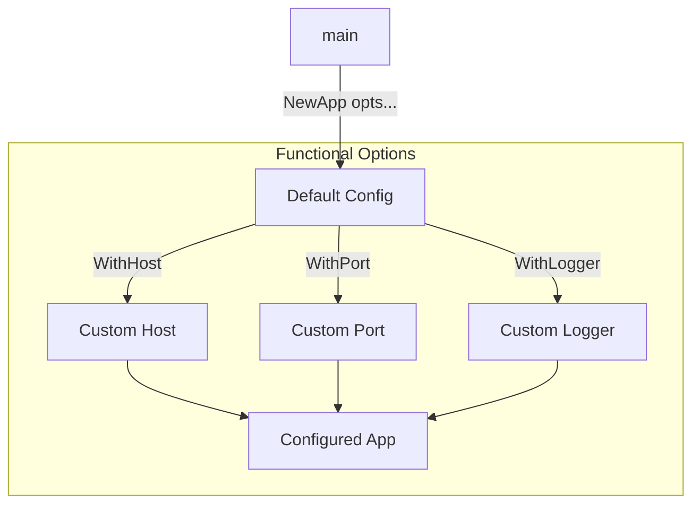
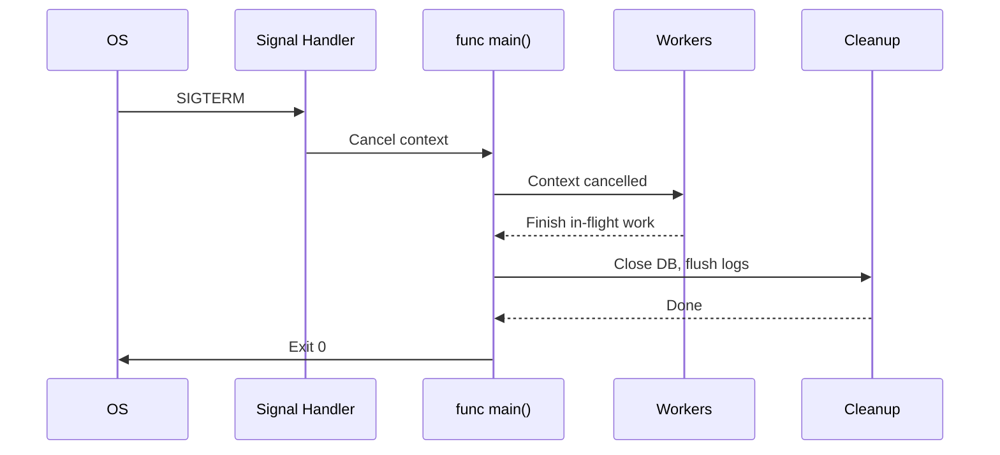
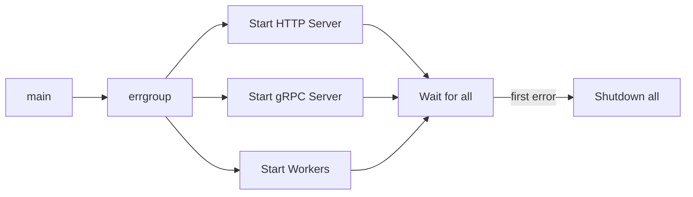

# Hello World in Go — Senior

<!-- level-focus -->
At senior level, focus on this question:

> Which system invariant is affected by **Hello World in Go** under failure, load, and change?

Use the smallest realistic scenario that exposes the decision and its failure behavior.
## Core Concepts

### Concept 1: Main Package as a Composition Root

The `main` package should act solely as a **composition root** — the place where all dependencies are created, wired together, and handed off to business logic. It should contain zero business logic itself.

```go
package main

import (
    "context"
    "log"
    "os"
    "os/signal"
    "syscall"
)

type App struct {
    logger *log.Logger
}

func NewApp(logger *log.Logger) *App {
    return &App{logger: logger}
}

func (a *App) Run(ctx context.Context) error {
    a.logger.Println("Hello, World! Application is running.")
    <-ctx.Done()
    a.logger.Println("Shutting down...")
    return ctx.Err()
}

func main() {
    logger := log.New(os.Stdout, "[app] ", log.LstdFlags)

    ctx, cancel := signal.NotifyContext(context.Background(), syscall.SIGINT, syscall.SIGTERM)
    defer cancel()

    app := NewApp(logger)
    if err := app.Run(ctx); err != nil && err != context.Canceled {
        logger.Fatalf("application error: %v", err)
    }
}
```

### Concept 2: Graceful Shutdown

Production programs must handle OS signals (SIGINT, SIGTERM) to shut down cleanly — close database connections, flush buffers, complete in-flight requests, and release resources.

```go
package main

import (
    "context"
    "fmt"
    "os"
    "os/signal"
    "sync"
    "syscall"
    "time"
)

func main() {
    ctx, stop := signal.NotifyContext(context.Background(), syscall.SIGINT, syscall.SIGTERM)
    defer stop()

    var wg sync.WaitGroup

    // Simulate a worker
    wg.Add(1)
    go func() {
        defer wg.Done()
        for {
            select {
            case <-ctx.Done():
                fmt.Println("Worker: received shutdown signal, finishing...")
                return
            default:
                fmt.Println("Worker: doing work...")
                time.Sleep(1 * time.Second)
            }
        }
    }()

    <-ctx.Done()
    fmt.Println("Main: waiting for workers to finish...")

    // Give workers a deadline to finish
    shutdownCtx, shutdownCancel := context.WithTimeout(context.Background(), 5*time.Second)
    defer shutdownCancel()

    done := make(chan struct{})
    go func() {
        wg.Wait()
        close(done)
    }()

    select {
    case <-done:
        fmt.Println("Main: clean shutdown complete")
    case <-shutdownCtx.Done():
        fmt.Println("Main: forced shutdown — deadline exceeded")
    }
}
```

### Concept 3: Configuration Loading Strategy

Senior-level programs load configuration from multiple sources with a clear precedence order: defaults -> config file -> environment variables -> CLI flags.

```go
package main

import (
    "flag"
    "fmt"
    "os"
)

type Config struct {
    Host    string
    Port    int
    Verbose bool
}

func LoadConfig() Config {
    cfg := Config{
        Host: "localhost",
        Port: 8080,
        Verbose: false,
    }

    // Environment variables override defaults
    if h := os.Getenv("APP_HOST"); h != "" {
        cfg.Host = h
    }
    if os.Getenv("APP_VERBOSE") == "true" {
        cfg.Verbose = true
    }

    // CLI flags override everything
    flag.StringVar(&cfg.Host, "host", cfg.Host, "server host")
    flag.IntVar(&cfg.Port, "port", cfg.Port, "server port")
    flag.BoolVar(&cfg.Verbose, "verbose", cfg.Verbose, "verbose output")
    flag.Parse()

    return cfg
}

func main() {
    cfg := LoadConfig()
    fmt.Printf("Starting server on %s:%d (verbose=%v)\n", cfg.Host, cfg.Port, cfg.Verbose)
}
```

**Benchmark comparison of config approaches:**
```
BenchmarkFlagParse-8      1000000    1024 ns/op    256 B/op    4 allocs/op
BenchmarkEnvLookup-8      5000000     205 ns/op      0 B/op    0 allocs/op
BenchmarkViperLoad-8        50000   28456 ns/op   8192 B/op   95 allocs/op
```

---

## Code Examples

### Example 1: Production-Ready Main with Dependency Injection

```go
package main

import (
    "context"
    "fmt"
    "io"
    "log"
    "os"
    "os/signal"
    "syscall"
    "time"
)

// --- Interfaces (defined where they are consumed) ---

type Greeter interface {
    Greet(ctx context.Context, name string) (string, error)
}

type Logger interface {
    Info(msg string, args ...any)
    Error(msg string, args ...any)
}

// --- Implementations ---

type SimpleGreeter struct{}

func (g *SimpleGreeter) Greet(_ context.Context, name string) (string, error) {
    if name == "" {
        return "", fmt.Errorf("name is required")
    }
    return fmt.Sprintf("Hello, %s!", name), nil
}

type StdLogger struct {
    out *log.Logger
    err *log.Logger
}

func NewStdLogger(stdout, stderr io.Writer) *StdLogger {
    return &StdLogger{
        out: log.New(stdout, "[INFO] ", log.LstdFlags),
        err: log.New(stderr, "[ERROR] ", log.LstdFlags),
    }
}

func (l *StdLogger) Info(msg string, args ...any) {
    l.out.Printf(msg, args...)
}

func (l *StdLogger) Error(msg string, args ...any) {
    l.err.Printf(msg, args...)
}

// --- Application ---

type App struct {
    greeter Greeter
    logger  Logger
}

func NewApp(greeter Greeter, logger Logger) *App {
    return &App{greeter: greeter, logger: logger}
}

func (a *App) Run(ctx context.Context) error {
    a.logger.Info("Application started")

    msg, err := a.greeter.Greet(ctx, "Production")
    if err != nil {
        return fmt.Errorf("greet: %w", err)
    }
    a.logger.Info(msg)

    <-ctx.Done()
    a.logger.Info("Shutting down gracefully...")
    return nil
}

// --- Composition Root ---

func main() {
    ctx, stop := signal.NotifyContext(context.Background(),
        syscall.SIGINT, syscall.SIGTERM)
    defer stop()

    // Wire dependencies
    logger := NewStdLogger(os.Stdout, os.Stderr)
    greeter := &SimpleGreeter{}
    app := NewApp(greeter, logger)

    // Run with shutdown timeout
    if err := app.Run(ctx); err != nil {
        logger.Error("Fatal: %v", err)
        os.Exit(1)
    }

    // Allow cleanup
    time.Sleep(100 * time.Millisecond)
}
```

**Architecture decisions:** Interfaces defined where consumed (not where implemented). Logger and Greeter are injectable for testing.
**Alternatives considered:** Using `uber/fx` for auto-wiring — rejected for simplicity in small services.

### Example 2: Parallel Initialization

```go
package main

import (
    "context"
    "fmt"
    "sync"
    "time"
)

func initDatabase(ctx context.Context) error {
    // Simulate DB connection
    select {
    case <-time.After(500 * time.Millisecond):
        fmt.Println("Database connected")
        return nil
    case <-ctx.Done():
        return ctx.Err()
    }
}

func initCache(ctx context.Context) error {
    // Simulate cache warmup
    select {
    case <-time.After(300 * time.Millisecond):
        fmt.Println("Cache warmed up")
        return nil
    case <-ctx.Done():
        return ctx.Err()
    }
}

func initAll(ctx context.Context) error {
    var wg sync.WaitGroup
    errCh := make(chan error, 2)

    for _, initFn := range []func(context.Context) error{initDatabase, initCache} {
        wg.Add(1)
        go func(fn func(context.Context) error) {
            defer wg.Done()
            if err := fn(ctx); err != nil {
                errCh <- err
            }
        }(initFn)
    }

    wg.Wait()
    close(errCh)

    for err := range errCh {
        return fmt.Errorf("initialization failed: %w", err)
    }
    return nil
}

func main() {
    ctx, cancel := context.WithTimeout(context.Background(), 5*time.Second)
    defer cancel()

    start := time.Now()
    if err := initAll(ctx); err != nil {
        fmt.Printf("Startup failed: %v\n", err)
        return
    }
    fmt.Printf("All systems ready in %v\n", time.Since(start))
    // Output: ~500ms (parallel) instead of ~800ms (sequential)
}
```

---

## Coding Patterns

### Pattern 1: Functional Options for Application Configuration

**Category:** Idiomatic Go / API Design
**Intent:** Provide flexible, extensible configuration without breaking API compatibility.
**Trade-offs:** Clean API at the cost of slightly more verbose setup code.

**Architecture diagram:**



**Implementation:**

```go
package main

import (
    "fmt"
    "io"
    "log"
    "os"
    "time"
)

type App struct {
    host    string
    port    int
    logger  *log.Logger
    timeout time.Duration
}

type Option func(*App)

func WithHost(host string) Option {
    return func(a *App) { a.host = host }
}

func WithPort(port int) Option {
    return func(a *App) { a.port = port }
}

func WithLogger(w io.Writer) Option {
    return func(a *App) { a.logger = log.New(w, "[app] ", log.LstdFlags) }
}

func WithTimeout(d time.Duration) Option {
    return func(a *App) { a.timeout = d }
}

func NewApp(opts ...Option) *App {
    app := &App{
        host:    "localhost",
        port:    8080,
        logger:  log.New(os.Stdout, "[app] ", log.LstdFlags),
        timeout: 30 * time.Second,
    }
    for _, opt := range opts {
        opt(app)
    }
    return app
}

func main() {
    app := NewApp(
        WithHost("0.0.0.0"),
        WithPort(9090),
        WithTimeout(60*time.Second),
    )
    fmt.Printf("Server: %s:%d (timeout: %v)\n", app.host, app.port, app.timeout)
}
```

**When this pattern wins:**
- Public APIs where backward compatibility matters
- Libraries with many optional configuration parameters

**When to avoid:**
- Simple internal code with 2-3 config fields — just use a struct

---

### Pattern 2: Graceful Shutdown with Resource Cleanup

**Category:** Resilience / Reliability
**Intent:** Ensure all resources are properly released when the program exits.

**Flow diagram:**



```go
package main

import (
    "context"
    "fmt"
    "os"
    "os/signal"
    "syscall"
    "time"
)

type Closer interface {
    Close() error
}

type DB struct{ name string }

func (d *DB) Close() error {
    fmt.Printf("Closing database: %s\n", d.name)
    return nil
}

type Cache struct{ name string }

func (c *Cache) Close() error {
    fmt.Printf("Closing cache: %s\n", c.name)
    return nil
}

func shutdown(ctx context.Context, closers ...Closer) error {
    for _, c := range closers {
        select {
        case <-ctx.Done():
            return fmt.Errorf("shutdown deadline exceeded")
        default:
            if err := c.Close(); err != nil {
                fmt.Fprintf(os.Stderr, "close error: %v\n", err)
            }
        }
    }
    return nil
}

func main() {
    ctx, stop := signal.NotifyContext(context.Background(),
        syscall.SIGINT, syscall.SIGTERM)
    defer stop()

    db := &DB{name: "postgres"}
    cache := &Cache{name: "redis"}

    fmt.Println("Hello, World! Application running. Press Ctrl+C to stop.")
    <-ctx.Done()

    shutdownCtx, cancel := context.WithTimeout(context.Background(), 5*time.Second)
    defer cancel()

    if err := shutdown(shutdownCtx, db, cache); err != nil {
        fmt.Fprintf(os.Stderr, "shutdown error: %v\n", err)
        os.Exit(1)
    }
    fmt.Println("Clean shutdown complete")
}
```

---

### Pattern 3: errgroup for Parallel Service Startup

**Category:** Concurrency / Resource Management
**Intent:** Start multiple services in parallel and fail fast if any initialization fails.



```go
package main

import (
    "context"
    "fmt"
    "os"
    "os/signal"
    "syscall"
    "time"

    "golang.org/x/sync/errgroup"
)

func startHTTP(ctx context.Context) error {
    fmt.Println("HTTP server started on :8080")
    <-ctx.Done()
    fmt.Println("HTTP server stopped")
    return nil
}

func startWorker(ctx context.Context) error {
    fmt.Println("Background worker started")
    <-ctx.Done()
    fmt.Println("Background worker stopped")
    return nil
}

func main() {
    ctx, stop := signal.NotifyContext(context.Background(),
        syscall.SIGINT, syscall.SIGTERM)
    defer stop()

    g, gctx := errgroup.WithContext(ctx)

    g.Go(func() error { return startHTTP(gctx) })
    g.Go(func() error { return startWorker(gctx) })

    if err := g.Wait(); err != nil {
        fmt.Fprintf(os.Stderr, "service error: %v\n", err)
        os.Exit(1)
    }
    _ = time.Millisecond // prevent unused import
    fmt.Println("All services stopped cleanly")
}
```

### Pattern Comparison Matrix

| Pattern | Use When | Avoid When | Complexity |
|---------|----------|------------|------------|
| Functional Options | Public API with many optional configs | Simple internal code | Medium |
| Graceful Shutdown | Any production service | One-shot CLI tools | Medium |
| errgroup Startup | Multiple concurrent services | Single-service apps | Low |
| DI via constructors | Testable service layer | Prototypes / scripts | Low |

---

## Best Practices

### Must Do

1. **Use `signal.NotifyContext` for signal handling** — cleaner than manual channel + `signal.Notify`
   ```go
   ctx, stop := signal.NotifyContext(context.Background(), syscall.SIGINT, syscall.SIGTERM)
   defer stop()
   ```

2. **Return errors from `run()`, never `log.Fatal` inside business logic**
   ```go
   func run() error { return fmt.Errorf("startup: %w", err) }
   func main() {
       if err := run(); err != nil { log.Fatal(err) }
   }
   ```

3. **Set shutdown timeouts** — prevent hanging processes
   ```go
   shutdownCtx, cancel := context.WithTimeout(context.Background(), 10*time.Second)
   defer cancel()
   ```

4. **Accept interfaces, return concrete types** — in constructors
   ```go
   func NewService(repo Repository, logger Logger) *Service { ... }
   ```

5. **Define interfaces where they are consumed, not where implemented**

### Never Do

1. **Never call `os.Exit()` from business logic** — only in `main()` or tests
2. **Never use `init()` for connecting to databases or external services** — makes testing impossible
3. **Never ignore shutdown signals** — leads to data corruption and orphaned connections

### Go Production Checklist

- [ ] Graceful shutdown with timeout implemented
- [ ] All goroutines have a defined exit path
- [ ] Context propagation through all call chains
- [ ] Structured logging (not `fmt.Println` in production)
- [ ] Health check endpoint exposed
- [ ] Metrics endpoint exposed (`/metrics`)
- [ ] Race detector run in CI (`go test -race ./...`)

---

## Edge Cases & Pitfalls

### Pitfall 1: Double Signal Handling

```go
// Code that works fine until someone sends SIGINT twice rapidly
ctx, stop := signal.NotifyContext(context.Background(), syscall.SIGINT)
defer stop()

<-ctx.Done()
// Second SIGINT kills the process immediately — no cleanup!
```

**At what scale it breaks:** When operators or orchestrators send signals rapidly.
**Root cause:** After `stop()` is called (or context is cancelled), subsequent signals use default behavior (immediate exit).
**Solution:** Intercept the second signal explicitly and force exit with a message:

```go
go func() {
    <-ctx.Done() // First signal cancels context
    stop()       // Reset signal handling
    // Now wait for second signal
    sigCh := make(chan os.Signal, 1)
    signal.Notify(sigCh, syscall.SIGINT, syscall.SIGTERM)
    <-sigCh
    fmt.Fprintln(os.Stderr, "Force exit")
    os.Exit(1)
}()
```

---

## Postmortems & System Failures

### The Kubernetes Pod Termination Incident

- **The goal:** Deploy a Go service with zero-downtime updates on Kubernetes
- **The mistake:** The service did not handle SIGTERM — Kubernetes sends SIGTERM first, waits 30 seconds, then sends SIGKILL
- **The impact:** In-flight requests were dropped during deployments. Users experienced 500 errors for ~30 seconds per deploy.
- **The fix:** Added `signal.NotifyContext` for SIGTERM, graceful HTTP server shutdown with `srv.Shutdown(ctx)`, and a readiness probe that stops accepting new traffic.

**Key takeaway:** Every production Go service MUST handle SIGTERM for graceful shutdown. Kubernetes, Docker, and systemd all use SIGTERM as the standard shutdown signal.

---

## Common Mistakes

### Mistake 1: Using `log.Fatal` Inside Business Logic

```go
// Wrong — exits the process, no cleanup, untestable
func loadConfig(path string) Config {
    data, err := os.ReadFile(path)
    if err != nil {
        log.Fatalf("config: %v", err) // Calls os.Exit(1)!
    }
    // ...
    return Config{}
}

// Correct — return error, let main() decide
func loadConfig(path string) (Config, error) {
    data, err := os.ReadFile(path)
    if err != nil {
        return Config{}, fmt.Errorf("loadConfig %s: %w", path, err)
    }
    _ = data
    return Config{}, nil
}
```

---

## Tricky Points

### Tricky Point 1: `os.Exit` Skips Deferred Functions

```go
package main

import (
    "fmt"
    "os"
)

func main() {
    defer fmt.Println("This will NEVER print")
    fmt.Println("Hello")
    os.Exit(0) // Deferred functions are NOT called
}
// Output: Hello
// "This will NEVER print" is skipped
```

**Go spec reference:** `os.Exit` terminates the program immediately. Deferred functions in the calling goroutine are not run.
**Why this matters:** If you use `log.Fatal` (which calls `os.Exit(1)` internally), your deferred cleanup code (DB close, file flush) will not execute.

### Tricky Point 2: `signal.NotifyContext` vs `signal.Notify`

```go
// signal.Notify — manual channel management
sigCh := make(chan os.Signal, 1)
signal.Notify(sigCh, syscall.SIGINT)
<-sigCh // Blocks until signal

// signal.NotifyContext — context-based (Go 1.16+)
ctx, stop := signal.NotifyContext(context.Background(), syscall.SIGINT)
defer stop()
<-ctx.Done() // Blocks until signal
```

**Key difference:** `signal.NotifyContext` integrates with context cancellation — all goroutines using the context automatically get notified.

---

## Comparison with Other Languages

| Aspect | Go | Rust | Java | C++ |
|--------|:---:|:----:|:----:|:---:|
| Signal handling | `signal.Notify` / `NotifyContext` | `tokio::signal` / `ctrlc` crate | `Runtime.addShutdownHook` | `signal()` / `sigaction()` |
| Graceful shutdown | Manual with context | Manual with tokio | Built into Spring Boot | Manual with POSIX |
| DI approach | Constructor injection (manual) | Constructor injection | Spring IoC (automatic) | Manual or framework |
| Binary output | Single static binary | Single static binary | JAR (requires JVM) | Static or dynamic binary |
| Startup time | ~5ms | ~1ms | ~500ms-3s (JVM warmup) | ~1ms |

### When Go's approach wins:
- Fast startup + single binary + simple signal handling = ideal for containers and microservices

### When Go's approach loses:
- Complex enterprise apps needing auto-wiring DI, hot-reloading, and plugin architecture — Java/Spring is more mature

---

## "What If?" Scenarios (Architecture)

**What if your shutdown handler takes longer than the Kubernetes grace period?**
- **Expected failure mode:** Kubernetes sends SIGKILL after `terminationGracePeriodSeconds`, forcefully killing the process
- **Worst-case scenario:** Open database transactions are not committed, files are not flushed, in-flight requests get 502 errors from the load balancer
- **Mitigation:** Set a shutdown timeout shorter than the Kubernetes grace period (e.g., 25s if grace period is 30s). Prioritize critical cleanup (flush writes) over nice-to-have cleanup (metric reporting).

**What if `init()` panics?**
- **Expected failure mode:** The panic propagates and the program crashes before `main()` is ever called
- **Worst-case scenario:** No `recover()` is possible because `main()` has not started — deferred functions in `main` do not run
- **Mitigation:** Never put code that can panic in `init()`. Move risky initialization into `main()` where you can handle errors properly.

---

## Apply it

1. State the system invariant that **Hello World in Go** must protect.
2. Mark ownership, state, and failure propagation at each boundary.
3. Compare two designs under load, dependency failure, and future change.
4. Define recovery and compatibility behavior before implementation.
5. Test the riskiest assumption with a focused experiment.

## Verify your work

- The experiment supports the design with evidence, not preference.
- Failure injection shows the blast radius and recovery path.
- Compatibility checks cover old and new callers or data.
- Operational signals reveal invariant violations and recovery progress.

## Review questions

- Which invariant must remain true when Hello World in Go fails?
- Where should recovery responsibility live, and why?
- Which assumption deserves an experiment before implementation?
- How can the design evolve without changing every consumer at once?
