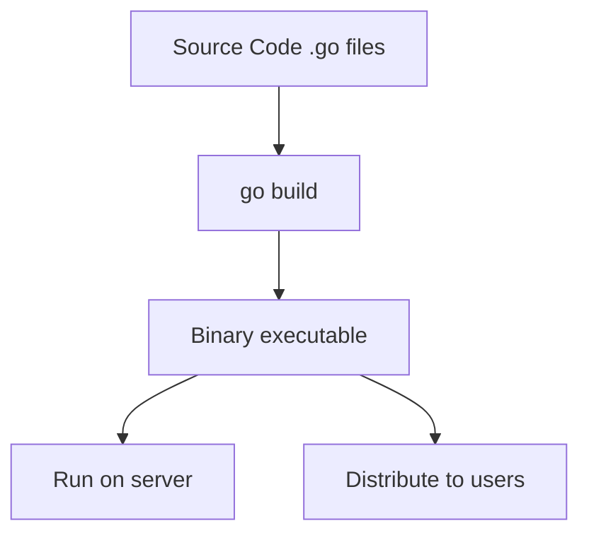
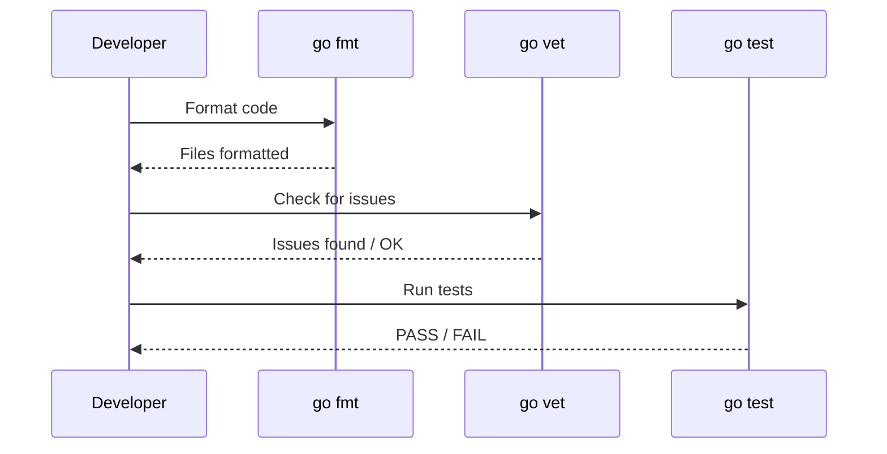

# Go Command — Junior

<!-- level-focus -->
At junior level, focus on this question:

> How can I apply **Go Command** in one small example and prove the result?

Use the smallest realistic scenario that exposes the decision and its failure behavior.
## Core Concepts

### Concept 1: `go run` — Run a program

`go run` compiles and immediately executes one or more `.go` files. It does not produce a permanent binary — the compiled output is placed in a temporary directory and deleted after execution.

```bash
go run main.go
go run .              # run the package in the current directory
go run ./cmd/server   # run a specific package
```

### Concept 2: `go build` — Compile a binary

`go build` compiles your code into an executable binary. By default the binary is named after the directory (or the `-o` flag overrides this).

```bash
go build              # produces binary named after directory
go build -o myapp     # produces binary named "myapp"
go build ./...        # compile all packages (check for errors)
```

### Concept 3: `go fmt` — Format code

`go fmt` rewrites your `.go` files to follow the standard Go formatting style. There is no configuration — every Go project looks the same.

```bash
go fmt ./...          # format all files in all packages
```

### Concept 4: `go vet` — Find suspicious code

`go vet` runs static analysis to find common mistakes that compile fine but are probably bugs.

```bash
go vet ./...          # vet all packages
```

### Concept 5: `go test` — Run tests

`go test` compiles and runs test functions (functions named `TestXxx` in `*_test.go` files).

```bash
go test ./...         # test all packages
go test -v ./...      # verbose output
go test -run TestFoo  # run only tests matching "TestFoo"
```

### Concept 6: `go mod init` — Initialize a module

Creates a new `go.mod` file in the current directory, declaring a new module.

```bash
go mod init github.com/user/project
```

### Concept 7: `go mod tidy` — Clean up dependencies

Adds missing dependencies and removes unused ones from `go.mod` and `go.sum`.

```bash
go mod tidy
```

### Concept 8: `go get` — Add or update dependencies

Downloads and installs packages and their dependencies, updating `go.mod`.

```bash
go get github.com/gin-gonic/gin           # add latest version
go get github.com/gin-gonic/gin@v1.9.1    # add specific version
go get -u ./...                            # update all dependencies
```

### Concept 9: `go install` — Install a binary

Compiles and installs a binary to `$GOPATH/bin` (or `$GOBIN`).

```bash
go install golang.org/x/tools/gopls@latest
```

### Concept 10: `go doc` — View documentation

Shows documentation for a package, function, type, or method.

```bash
go doc fmt              # package-level doc
go doc fmt.Println      # function doc
go doc -all fmt         # everything in the package
```

### Concept 11: `go version` and `go env`

```bash
go version              # prints Go version: go version go1.22.0 linux/amd64
go env                  # prints all Go environment variables
go env GOPATH           # print a specific variable
```

---

## Code Examples

### Example 1: Hello World with `go run`

```go
// Save as main.go
package main

import "fmt"

func main() {
    fmt.Println("Hello, World!")
}
```

**What it does:** Prints "Hello, World!" to the terminal.
**How to run:** `go run main.go`

### Example 2: Building and running a binary

```go
// Save as main.go
package main

import (
    "fmt"
    "os"
)

func main() {
    name := "Go Developer"
    if len(os.Args) > 1 {
        name = os.Args[1]
    }
    fmt.Printf("Hello, %s!\n", name)
}
```

**What it does:** Greets the user by name (defaults to "Go Developer").
**How to run:**
```bash
go build -o greeter main.go
./greeter Alice
# Output: Hello, Alice!
```

### Example 3: Writing and running a test

```go
// Save as math.go
package main

func Add(a, b int) int {
    return a + b
}

func main() {}
```

```go
// Save as math_test.go
package main

import "testing"

func TestAdd(t *testing.T) {
    result := Add(2, 3)
    if result != 5 {
        t.Errorf("Add(2, 3) = %d; want 5", result)
    }
}
```

**How to run:** `go test -v`
**Output:**
```
=== RUN   TestAdd
--- PASS: TestAdd (0.00s)
PASS
ok      example 0.001s
```

### Example 4: Initializing a module and adding a dependency

```bash
# Create a new project
mkdir myproject && cd myproject
go mod init github.com/user/myproject

# Create main.go
cat > main.go << 'EOF'
package main

import (
    "fmt"
    "github.com/fatih/color"
)

func main() {
    color.Green("Hello in green!")
    fmt.Println("Regular text")
}
EOF

# Download the dependency
go mod tidy

# Run the program
go run main.go
```

---

## Coding Patterns

### Pattern 1: Build-then-run workflow

**Intent:** Separate compilation from execution for repeatable deployments.
**When to use:** When deploying to production or distributing binaries.

```bash
# Step 1: Build
go build -o server ./cmd/server

# Step 2: Run
./server --port=8080
```

**Diagram:**



**Remember:** Use `go run` for development, `go build` for production.

---

### Pattern 2: Test-format-vet cycle

**Intent:** Catch bugs and style issues before committing code.
**When to use:** Before every `git commit`.

```bash
# Format all code
go fmt ./...

# Run static analysis
go vet ./...

# Run all tests
go test ./...
```

**Diagram:**



---

## Best Practices

- **Always run `go fmt ./...` before committing** — keeps code style consistent
- **Always run `go vet ./...` in CI** — catches bugs that compile fine but are wrong
- **Use `go mod tidy` regularly** — keeps `go.mod` clean and accurate
- **Use `go test -race ./...` in CI** — detects data races that cause intermittent bugs
- **Never commit `vendor/` unless required** — `go mod download` reproduces it

---

## Edge Cases & Pitfalls

### Pitfall 1: `go run` with multiple files

```bash
# This fails if main() uses functions from other files
go run main.go
# Error: undefined: helperFunction

# Fix: include all files
go run main.go helpers.go
# Better: run the whole package
go run .
```

**What happens:** `go run main.go` only compiles `main.go`, not other files in the package.
**How to fix:** Use `go run .` to compile the entire package.

### Pitfall 2: `go get` inside vs outside a module

```bash
# Inside a module directory (has go.mod) — adds dependency to go.mod
go get github.com/pkg/errors

# Outside a module directory — installs binary (Go 1.17+, use go install instead)
go install github.com/golangci/golangci-lint/cmd/golangci-lint@latest
```

---

## Common Mistakes

### Mistake 1: Forgetting `go mod tidy` after adding imports

```go
// You add a new import:
import "github.com/sirupsen/logrus"

// But forget to run:
// go mod tidy
// Result: build fails with "missing go.sum entry"
```

### Mistake 2: Using `go get` to install tools (deprecated since Go 1.17)

```bash
# Wrong way (deprecated)
go get golang.org/x/tools/gopls

# Correct way
go install golang.org/x/tools/gopls@latest
```

### Mistake 3: Running `go test` without `./...`

```bash
# Only tests the current directory
go test

# Tests ALL packages recursively
go test ./...
```

---

## Common Misconceptions

### Misconception 1: "`go run` is the same as `go build` + running the binary"

**Reality:** `go run` creates a temporary binary in a temp directory and deletes it afterward. It is NOT the same as `go build -o app && ./app` because the binary path and caching behavior differ.

**Why people think this:** The output looks the same, so it seems identical.

### Misconception 2: "`go fmt` is optional"

**Reality:** While `go fmt` does not affect compilation, it is considered mandatory in the Go community. Most CI pipelines reject code that is not properly formatted.

**Why people think this:** Other languages treat formatting as a preference, but Go enforces a single standard.

---

## Tricky Points

### Tricky Point 1: `go build` produces no output for library packages

```bash
cd mylib/   # a package without func main()
go build    # no binary produced, no error
```

**Why it's tricky:** Beginners expect a binary to appear. `go build` on a non-main package only checks for compilation errors.
**Key takeaway:** Only `package main` with `func main()` produces an executable.

### Tricky Point 2: `go test` caches results

```bash
go test ./...          # runs tests
go test ./...          # uses cached results (prints "ok (cached)")
go test -count=1 ./... # forces re-run
```

**Why it's tricky:** You might think tests ran again, but they used cached results.
**Key takeaway:** Use `-count=1` to force fresh test execution.

---

## "What If?" Scenarios

**What if you delete `go.sum` and run `go build`?**
- **You might think:** The build will fail because checksums are missing.
- **But actually:** Go will re-download modules and regenerate `go.sum`. The build succeeds, but you should commit the new `go.sum`.

**What if you run `go fmt` on a file with syntax errors?**
- **You might think:** `go fmt` will format it anyway.
- **But actually:** `go fmt` will print the syntax error and leave the file unchanged. It only formats valid Go code.

---

## Apply it

1. Choose one small, known input for **Go Command**.
2. Predict the output or observable behavior.
3. Run the smallest example or probe that exercises the concept.
4. Change one input to trigger a failure or boundary case.
5. Explain the evidence using the guide's vocabulary.

## Verify your work

- Record the exact input, command or code path, and output.
- Repeat the probe and confirm the result is consistent.
- Show one expected success and one expected failure.
- Resolve any difference between the prediction and the evidence.

## Review questions

- What problem does Go Command solve in the example?
- Which input changes the observed result, and why?
- What is the smallest useful success check?
- Which beginner mistake would your evidence catch?
