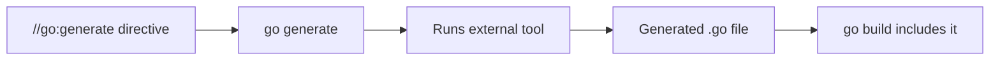
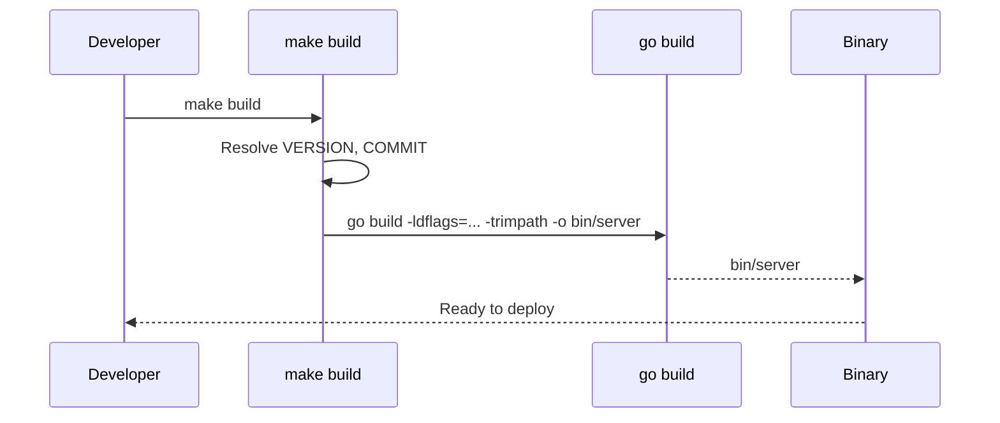
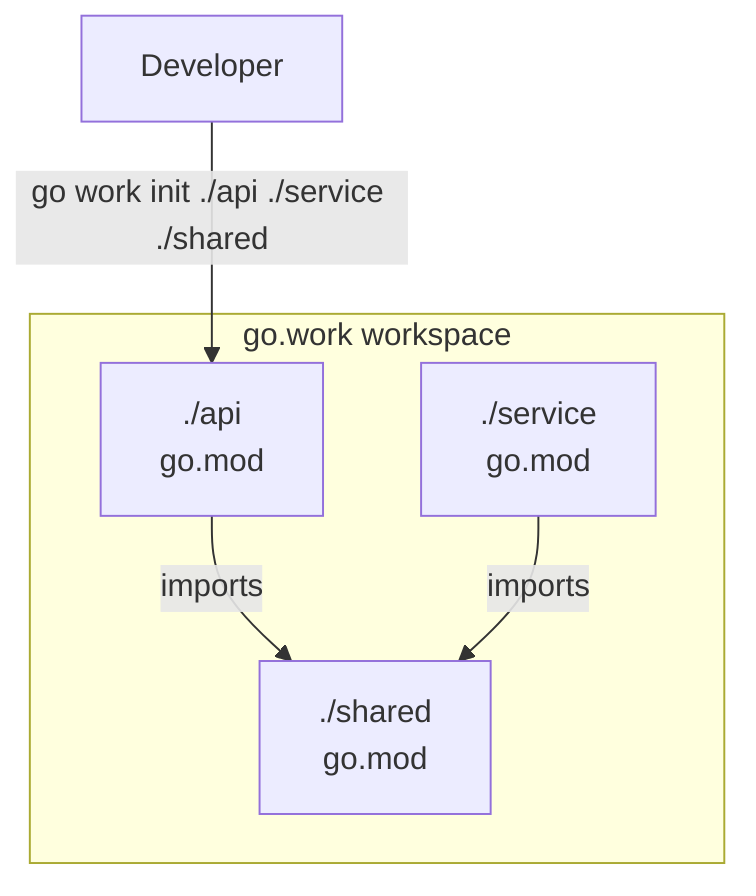
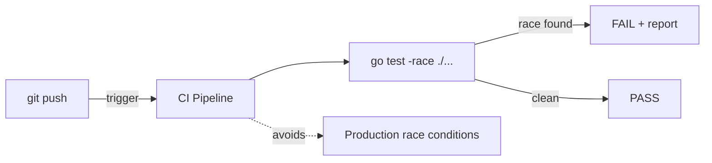

# Go Command — Middle

<!-- level-focus -->
At middle level, focus on this question:

> Where does **Go Command** belong in a maintainable component, and which trade-off selects the design?

Use the smallest realistic scenario that exposes the decision and its failure behavior.
## Core Concepts

### Concept 1: `go generate` — Code generation

`go generate` scans `.go` files for special `//go:generate` comments and runs the specified commands. It is NOT part of the build process — you run it manually when your generated code needs updating.

```go
//go:generate stringer -type=Color
//go:generate mockgen -source=repo.go -destination=mock_repo.go
//go:generate protoc --go_out=. proto/service.proto
```

```bash
go generate ./...   # run all generate directives
```



### Concept 2: Build flags — controlling compilation

Build flags let you inject values, enable analysis, and control output:

```bash
# -ldflags: inject values at link time
go build -ldflags="-X main.version=1.2.3 -X main.buildTime=$(date -u +%Y%m%d%H%M%S)" -o server

# -gcflags: control the Go compiler
go build -gcflags="-m"          # show escape analysis decisions
go build -gcflags="-m -m"       # more verbose escape analysis
go build -gcflags="-N -l"       # disable optimizations (for debugging)

# -race: enable the race detector
go build -race -o server
go test -race ./...

# -trimpath: remove local file paths from binary
go build -trimpath -o server

# -tags: build with custom build tags
go build -tags "integration,debug" -o server
```

### Concept 3: `go tool` — access internal tools

`go tool` provides access to lower-level tools bundled with Go:

```bash
go tool pprof cpu.prof          # profile analysis
go tool trace trace.out         # execution trace viewer
go tool objdump -s main.main ./server  # disassemble binary
go tool compile -S main.go     # show assembly output
go tool nm ./server             # list symbols
```

### Concept 4: `go clean` — remove build artifacts

```bash
go clean                # remove object files
go clean -cache         # remove build cache (~/.cache/go-build)
go clean -testcache     # remove test cache only
go clean -modcache      # remove downloaded modules ($GOPATH/pkg/mod)
```

### Concept 5: Module deep commands

```bash
# go mod vendor — copy dependencies into vendor/ directory
go mod vendor

# go mod why — explain why a dependency is needed
go mod why github.com/pkg/errors

# go mod graph — print module dependency graph
go mod graph

# go mod download — download modules to local cache
go mod download
```

### Concept 6: `go work` — multi-module workspaces

Workspaces let you work on multiple related modules simultaneously without publishing:

```bash
# Initialize a workspace
go work init ./api ./service ./shared

# Add a module to workspace
go work use ./newmodule

# Sync workspace with modules
go work sync
```

This creates a `go.work` file:

```
go 1.22

use (
    ./api
    ./service
    ./shared
)
```

---

## Evolution & Historical Context

**Before Go modules (pre-Go 1.11):**
- Developers used `GOPATH` — all Go code lived under a single directory
- Dependency management relied on third-party tools: `dep`, `glide`, `godep`
- No versioning — `go get` always fetched `master`

**How modules changed things:**
- `go.mod` introduced explicit versioning and reproducible builds
- `go mod tidy` replaced manual dependency management
- The checksum database (`sum.golang.org`) added supply-chain security
- `go work` (Go 1.18) enabled multi-module development without replace directives

---

## Alternative Approaches (Plan B)

| Alternative | How it works | When you might be forced to use it |
|-------------|--------------|-----------------------------------|
| **Makefile** | Wraps `go` commands with variables and targets | Complex build pipelines with non-Go steps |
| **Bazel** | Hermetic build system with remote caching | Huge monorepos with multiple languages |

---

## Code Examples

### Example 1: Version injection with `-ldflags`

```go
package main

import "fmt"

// These variables are set at build time via -ldflags
var (
    version   = "dev"
    buildTime = "unknown"
    gitCommit = "none"
)

func main() {
    fmt.Printf("Version:    %s\n", version)
    fmt.Printf("Build Time: %s\n", buildTime)
    fmt.Printf("Git Commit: %s\n", gitCommit)
}
```

**Build command:**
```bash
go build -ldflags="\
  -X main.version=1.2.3 \
  -X main.buildTime=$(date -u +%Y-%m-%dT%H:%M:%SZ) \
  -X main.gitCommit=$(git rev-parse --short HEAD)" \
  -o server
```

**Why this pattern:** Avoids hardcoding version info. The binary itself reports its version accurately.
**Trade-offs:** Build scripts become more complex; `-ldflags` strings are fragile.

### Example 2: `go generate` with stringer

```go
package main

import "fmt"

//go:generate stringer -type=Status

type Status int

const (
    Pending  Status = iota
    Active
    Inactive
    Deleted
)

func main() {
    fmt.Println(Active) // prints "Active" instead of "1"
}
```

```bash
# Install stringer
go install golang.org/x/tools/cmd/stringer@latest

# Generate the String() method
go generate ./...

# Build and run
go run .
```

---

## Coding Patterns

### Pattern 1: Makefile wrapper

**Category:** Idiomatic
**Intent:** Standardize build commands across the team.
**When to use:** When build commands have multiple flags or steps.
**When NOT to use:** Simple projects where `go build` suffices.

```makefile
# Makefile
VERSION  := $(shell git describe --tags --always)
COMMIT   := $(shell git rev-parse --short HEAD)
LDFLAGS  := -X main.version=$(VERSION) -X main.gitCommit=$(COMMIT)

.PHONY: build test lint

build:
	go build -ldflags="$(LDFLAGS)" -trimpath -o bin/server ./cmd/server

test:
	go test -race -count=1 -coverprofile=coverage.out ./...

lint:
	go fmt ./...
	go vet ./...
	staticcheck ./...

generate:
	go generate ./...

clean:
	go clean -cache -testcache
	rm -rf bin/
```

**Diagram:**



**Trade-offs:**

| Pros | Cons |
|---------|---------|
| One command for complex builds | Extra file to maintain |
| Consistent across team | Requires `make` installed |

---

### Pattern 2: Multi-module workspace

**Category:** Idiomatic Go
**Intent:** Develop multiple interdependent modules without publishing.



```bash
# Project structure
mkdir -p myproject/{api,service,shared}

# Initialize each module
cd myproject/shared && go mod init github.com/user/shared
cd ../api && go mod init github.com/user/api
cd ../service && go mod init github.com/user/service

# Create workspace at project root
cd ..
go work init ./api ./service ./shared

# Now changes to ./shared are immediately visible in ./api and ./service
go build ./...
```

---

### Pattern 3: Race detection in CI

**Category:** Idiomatic Go / Testing
**Intent:** Catch data races automatically.



```yaml
# .github/workflows/test.yml
name: Test
on: [push, pull_request]
jobs:
  test:
    runs-on: ubuntu-latest
    steps:
      - uses: actions/checkout@v4
      - uses: actions/setup-go@v5
        with:
          go-version: '1.22'
      - run: go test -race -count=1 ./...
```

---

## Best Practices

- **Use `-race` in CI tests:** `go test -race ./...` catches races before production
- **Use `-trimpath` in production builds:** Removes local file paths from binaries
- **Use `go mod tidy` as a CI check:** Run `go mod tidy && git diff --exit-code go.mod go.sum` to ensure dependencies are clean
- **Cache build artifacts in CI:** Persist `~/.cache/go-build` and `~/go/pkg/mod` between runs
- **Never commit `go.work`:** Workspace files are for local development only

---

## Edge Cases & Pitfalls

### Pitfall 1: `-ldflags` with special characters

```bash
# Breaks — spaces in value
go build -ldflags="-X main.name=My App"

# Works — use single quotes inside double quotes
go build -ldflags="-X 'main.name=My App'"
```

**Impact:** Build fails silently or injects wrong values.
**Detection:** Print injected variables at startup.
**Fix:** Use quoting or avoid spaces in injected values.

### Pitfall 2: `go.work` leaking into CI builds

```bash
# Developer has go.work locally
# CI clones repo and runs go build
# If go.work is committed, CI uses local paths that don't exist

# Fix: add go.work to .gitignore
echo "go.work*" >> .gitignore
```

---

## Common Mistakes

### Mistake 1: Running `go generate` in CI without checking results

```bash
# Wrong — generate but don't check if files changed
go generate ./...
go build ./...

# Correct — ensure generated files are committed
go generate ./...
git diff --exit-code
# If files changed, the developer forgot to run go generate
```

### Mistake 2: Using `-race` in production builds

```bash
# Wrong — race detector has 5-10x overhead
go build -race -o server
./server  # running in production with race detector

# Correct — race detector only in tests
go test -race ./...
go build -o server  # production build without -race
```

---

## Common Misconceptions

### Misconception 1: "`go generate` runs automatically during `go build`"

**Reality:** `go generate` is a completely separate step. `go build` never executes `//go:generate` directives. You must run `go generate` manually and commit the output.

**Evidence:**
```bash
# This does NOT run go generate
go build ./...
# You must explicitly run:
go generate ./...
go build ./...
```

### Misconception 2: "`go mod vendor` is required for all projects"

**Reality:** Vendoring is optional. Most projects use `go mod tidy` + `GOPROXY` (default: `proxy.golang.org`). Vendor is only needed for air-gapped environments or when you want zero-network builds.

---

## Anti-Patterns

### Anti-Pattern 1: Shell scripts instead of Makefile

```bash
# Anti-pattern — 5 different build scripts
./scripts/build.sh
./scripts/test.sh
./scripts/lint.sh
./scripts/generate.sh
./scripts/deploy.sh
```

**Why it's bad:** No dependency tracking, no parallel execution, harder to discover.
**The refactoring:** Use a single `Makefile` with documented targets.

---

## Tricky Points

### Tricky Point 1: `go test -count=1` disables caching

```bash
go test ./...          # second run uses cache
go test -count=1 ./... # forces re-execution
```

**What actually happens:** Any flag that changes test execution invalidates the cache. `-count=1` is the idiomatic way to disable caching.
**Why:** The test cache is content-addressed. Changing any input (flags, env, files) produces a cache miss.

### Tricky Point 2: `go build -race` changes binary behavior

```go
package main

import "sync"

var counter int

func main() {
    var wg sync.WaitGroup
    for i := 0; i < 100; i++ {
        wg.Add(1)
        go func() {
            defer wg.Done()
            counter++ // data race
        }()
    }
    wg.Wait()
}
```

```bash
go run main.go        # appears to work fine
go run -race main.go  # WARNING: DATA RACE detected
```

**Why:** The race detector instruments memory accesses. Without it, the race exists but Go does not report it.

---

## Comparison with Other Languages

| Aspect | Go (`go` command) | Rust (`cargo`) | Java (`maven/gradle`) | Python (`pip/poetry`) |
|--------|-----|------|------|--------|
| All-in-one tool | Yes | Yes | No (build + test separate) | No (pip + pytest separate) |
| Formatter | `go fmt` (built-in) | `rustfmt` (separate) | Various plugins | `black` (separate) |
| Race detector | `go test -race` | Not built-in | Not built-in | Not applicable |
| Dependency lock | `go.sum` | `Cargo.lock` | `pom.xml` / lock file | `poetry.lock` |
| Code generation | `go generate` | Proc macros (built-in) | Annotation processors | N/A |

### Key differences:
- **Go vs Rust:** Go has a simpler tool (`go` does everything); Rust's `cargo` is similar but has more sub-commands (publish, bench, clippy)
- **Go vs Java:** Go's single binary vs Java's ecosystem of separate tools (Maven, Gradle, JUnit, Checkstyle)
- **Go vs Python:** Go has built-in testing and formatting; Python requires pip-installing multiple tools

---

## Apply it

1. Find a real component where **Go Command** affects an interface or dependency.
2. Write two plausible choices and the constraint that favors each one.
3. Make the smallest reversible change at that boundary.
4. Exercise the component alone, then exercise the integrated flow.
5. Keep the decision note with the evidence that selected the option.

## Verify your work

- A focused check proves the local behavior.
- An integrated check proves callers and dependencies still agree.
- Logs, traces, compiler output, or benchmarks expose the boundary.
- Reverting the change restores the previous behavior without unrelated edits.

## Review questions

- Which boundary is most affected by Go Command?
- What constraint would make you choose the alternative design?
- How would you isolate a local defect from an integration defect?
- What evidence shows that the change remains maintainable?
