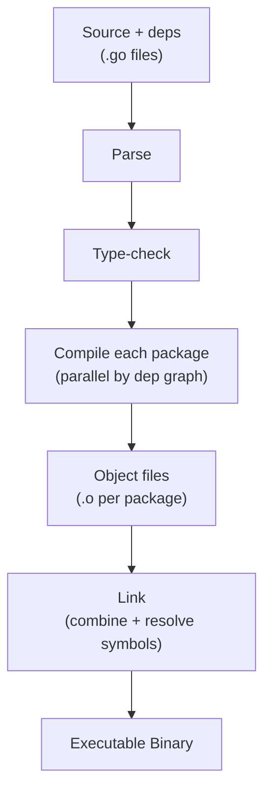
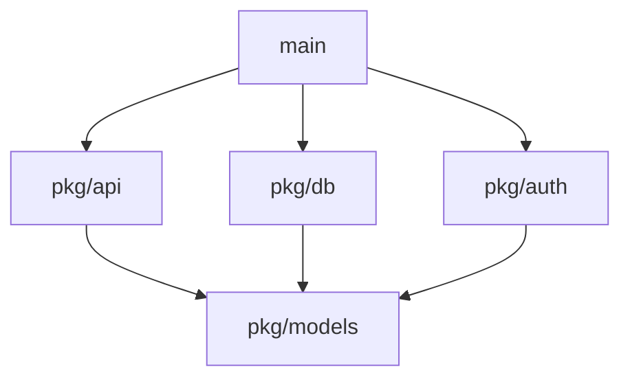

# Go Command — Under the Hood

<!-- level-focus -->
At professional level, focus on this question:

> How should teams adopt and operate **Go Command — Under the Hood** with measurable outcomes and limited coordination?

Use the smallest realistic scenario that exposes the decision and its failure behavior.
## What `go build` Does

When you run `go build ./...`, the `go` command coordinates a multi-stage pipeline.
At a high level:

1. **Resolve packages** — figure out which packages the build targets name, and the
   full set of dependencies via the module graph.
2. **Parse & type-check** — for each package, the compiler reads the `.go` files,
   parses them into a syntax tree, and type-checks them (name resolution, type
   inference, assignment/interface checks).
3. **Compile each package** — the compiler turns each type-checked package into a
   single object file containing machine code plus metadata. Independent packages
   are compiled in parallel based on the dependency graph.
4. **Link** — the linker combines all the object files (your packages, the standard
   library, and the runtime) into one executable, resolving symbols and laying out
   the final binary.



The `go` command is a *driver*: it doesn't compile or link anything itself. It works
out the dependency graph, decides what is out of date, and invokes the underlying
tools (`compile`, `link`, `asm`, and friends) as subprocesses, feeding object files
between them.

```bash
# See the actual commands the go tool runs
go build -x ./...        # print each underlying command
go build -v ./...        # print packages as they are compiled
```

Because compilation happens per package and the package graph is known up front, the
`go` tool compiles independent packages concurrently:



Here `pkg/models` must compile first (everyone depends on it); then `pkg/api`,
`pkg/db`, and `pkg/auth` can compile in parallel; `main` is linked last.

---

## The Build Cache

The `go` command keeps a build cache so it never recompiles a package whose inputs
have not changed. This is the single biggest reason repeated builds are fast.

```bash
go env GOCACHE          # location of the build cache (e.g. ~/.cache/go-build)
go clean -cache         # wipe the build cache
```

The cache is **content-addressed**. For each package the `go` tool computes a cache
key from everything that can affect the output:

```
key = hash(import path
           + source file contents
           + dependency hashes
           + compiler/build flags
           + Go toolchain version
           + GOOS/GOARCH)
```

If a key is already present in the cache, the previously compiled result is reused
and the compiler is never invoked for that package. If anything in the inputs
changes — a source byte, a flag, the Go version — the key changes and the package is
rebuilt. This is why changing a single `-gcflags` value or upgrading Go triggers a
full rebuild: every cache key shifts.

```bash
ls $(go env GOCACHE)
# 00/ 01/ ... ff/  (hex-prefix directories of hash-named entries)
```

`go test` uses the same machinery to cache *test results*: if neither the test
binary nor its inputs changed, you see `(cached)` instead of a re-run.

---

## Modules: Download & Resolution

When your code imports a package that isn't in the standard library or your module,
the `go` command has to find it, download it, and pin a version. This is the module
system, and most of it happens transparently during `go build`/`go test`.

### Resolution

`go.mod` lists your direct dependencies and their minimum versions. The `go` tool
uses **minimal version selection (MVS)**: it walks the dependency graph and, for each
module, picks the *highest minimum version* required by anything in the build. The
exact selected versions (including indirect ones) are recorded in `go.sum` with
cryptographic hashes for integrity.

### Download & the module cache

```bash
go env GOMODCACHE       # where downloaded modules live (e.g. ~/go/pkg/mod)
go env GOPROXY          # where modules are fetched from
```

When a required module/version is not already in `GOMODCACHE`, the `go` command
downloads it — by default through the **module proxy** (`proxy.golang.org`) rather
than cloning the source repository directly. The proxy serves immutable, versioned
zip files, which makes downloads fast and reproducible.

```
go build needs example.com/foo@v1.2.0
        |
        v
in GOMODCACHE?  --yes--> use it
        |
        no
        v
fetch from GOPROXY (proxy.golang.org by default)
        |
        v
verify hash against go.sum (and GONOSUMDB/GOSUMDB checksum db)
        |
        v
unpack into GOMODCACHE (read-only)
```

Downloaded modules are verified against `go.sum` and the checksum database, then
stored read-only in the module cache so every project on the machine can share them.

```bash
go mod download         # pre-fetch all dependencies into GOMODCACHE
go clean -modcache      # remove the entire module cache
GOFLAGS=-mod=mod go build   # let the build update go.mod/go.sum as needed
```

Relevant environment knobs the `go` command honors:

| Variable     | Role                                                       |
|--------------|------------------------------------------------------------|
| `GOPROXY`    | Comma-separated list of proxies (or `direct`/`off`)        |
| `GOMODCACHE` | On-disk location of downloaded modules                     |
| `GOSUMDB`    | Checksum database used to verify new module hashes         |
| `GOPRIVATE`  | Glob patterns that bypass the proxy/checksum db (private repos) |
| `GONOSUMCHECK` / `GOFLAGS` | Adjust verification and default build flags  |

---

## What `go build` Produces

The output of `go build` is a **single executable file**. There is no separate set of
`.so`/`.dll` files to ship alongside it: by default Go links everything — your code,
the standard library, and the runtime — statically into one binary.

```bash
go build -o server ./cmd/server
file ./server       # statically linked (when CGO is disabled)
```

This is why a "do nothing" Go program is still ~1–2 MB: the runtime (scheduler,
garbage collector, memory allocator) is always linked in, because even an empty
`main` runs as a goroutine under that runtime.

```go
package main

func main() {}
```

```bash
CGO_ENABLED=0 go build -ldflags="-s -w" -o minimal main.go
ls -lh minimal      # ~1–2 MB — that's the Go runtime, not your code
```

The single-binary model is a major operational advantage: deployment is "copy one
file and run it," with no runtime, interpreter, or shared libraries to install on the
target machine. The `-ldflags="-s -w"` flags reduce size by stripping the symbol
table and DWARF debug info, at the cost of debuggability.

> Note: cross-compilation is just setting `GOOS`/`GOARCH` before `go build` — the same
> driver, compiler, and linker produce a binary for a different target. No extra
> toolchain install is needed for pure-Go programs.

```bash
GOOS=linux GOARCH=arm64 go build -o server-linux-arm64 ./cmd/server
```

---

## Build IDs & Reproducibility

Every binary the `go` command produces embeds metadata you can inspect with the tool
itself — no third-party tools required:

```bash
go version -m ./server      # Go version + module versions + build settings
```

This works because `go build` stamps a **build ID** and **build info** into the
binary: the Go toolchain version, the main module path, the exact versions of all
dependencies, and the build settings (flags, `CGO_ENABLED`, `GOOS`, `GOARCH`, VCS
revision). Your program can read the same data at runtime:

```go
package main

import (
    "fmt"
    "runtime/debug"
)

func main() {
    info, ok := debug.ReadBuildInfo()
    if !ok {
        return
    }
    fmt.Printf("Go version: %s\n", info.GoVersion)
    fmt.Printf("Module: %s\n", info.Main.Path)
    for _, s := range info.Settings {
        fmt.Printf("  %s = %s\n", s.Key, s.Value)
    }
}
```

```
Go version: go1.22.0
Module: github.com/user/app
  -ldflags = -s -w -X main.version=1.0.0
  -trimpath = true
  CGO_ENABLED = 0
  GOARCH = amd64
  GOOS = linux
  vcs.revision = a1b2c3d
```

### Reproducible builds

Because the build cache key and the embedded build info are both derived from the
inputs, the same source + same toolchain + same flags produce a **byte-for-byte
identical binary**. Two things help make this hold across machines:

- `-trimpath` removes absolute filesystem paths from the binary, so the build does
  not depend on *where* the source lives.
- Pinned dependency versions in `go.mod`/`go.sum` ensure the same source is compiled
  every time.

```bash
go build -trimpath -ldflags="-s -w" -o server ./cmd/server
```

Reproducibility is a property the `go` command gives you almost for free, and it is
what makes supply-chain verification (rebuild and compare hashes) possible.

---

## Apply it

1. Define the user or business outcome that **Go Command — Under the Hood** should improve.
2. Assign one owner for code, contracts, operations, and incidents.
3. Split delivery into reversible increments that produce evidence early.
4. Publish responsibilities, escalation paths, and compatibility windows.
5. Stop or expand only when the agreed measures support that decision.

## Verify your work

- Each increment has an owner, rollback path, and observable exit condition.
- Adoption, reliability, delivery time, and coordination cost are measured.
- Incident and migration exercises prove that responsibility is executable.
- The old path is removed only after telemetry proves it is unused.

## Review questions

- Which measurable outcome justifies investing in Go Command — Under the Hood?
- Which team owns the full lifecycle and incident response?
- What reversible increment produces the earliest useful evidence?
- Which exit condition proves that migration or adoption is complete?
