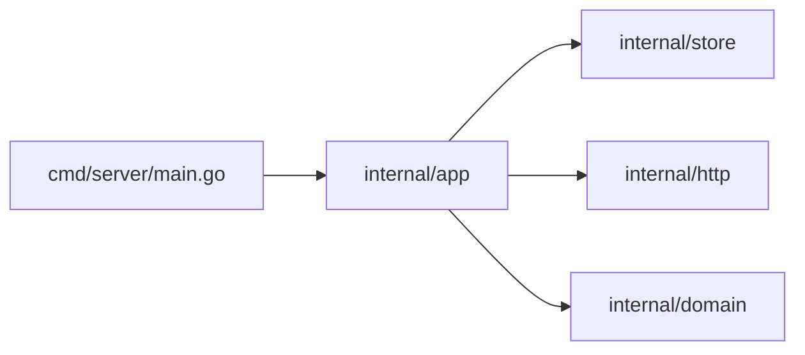

# Project Layout — Junior

<!-- level-focus -->
At junior level, focus on this question:

> How can I apply **Project Layout** in one small example and prove the result?

Use the smallest realistic scenario that exposes the decision and its failure behavior.
## Core Concepts

### One directory equals one package

This is the foundational rule. Every `.go` file in a directory must declare the **same** `package` name, and that directory is the package the rest of the codebase imports.

```
internal/auth/
├── login.go    // package auth
├── logout.go   // package auth
└── token.go    // package auth
```

Three files, one package: `auth`. To use any function from any of these files, another package writes:

```go
import "example.com/myapp/internal/auth"

auth.Login(...)
auth.IssueToken(...)
```

You cannot have two packages in the same directory. You cannot split one package across two directories. Filename is a comment to humans; what the compiler cares about is the directory and the `package` clause.

### The module path is the import path's prefix

Open your `go.mod`:

```
module example.com/myapp

go 1.22
```

Every directory inside this module is importable as `example.com/myapp/<relative-path>`. So `internal/auth/login.go` is reached at `example.com/myapp/internal/auth`. The directory tree and the import path are isomorphic — there is no `src/`, no `pom.xml`, no separate "namespace" file. The disk *is* the import graph.

### `internal/` is a fence the toolchain enforces

Any directory named `internal/` partitions the tree:

- Packages under `<root>/internal/...` can be imported **only** by packages rooted at `<root>/...`.
- Packages outside `<root>` (other modules, other tools) cannot import them — `go build` rejects the import with a hard error.

This is the *only* layout convention the Go toolchain enforces. Everything else (`cmd/`, `pkg/`, `api/`) is naming on top of normal directories.

### `cmd/<binary>/` holds one `main` per binary

A `package main` declaration with `func main()` produces an executable. If your repo ships **one** binary, you can put `main.go` at the root. If you ship **two or more**, you need a separate `main` package per binary, and the conventional location is `cmd/<binary-name>/main.go`:

```
cmd/
├── server/
│   └── main.go      // package main → "server" binary
└── cli/
    └── main.go      // package main → "cli" binary
```

`go build ./cmd/server` builds one. `go build ./cmd/cli` builds the other. `go build ./...` builds both.

### `pkg/` is convention, not enforcement

A folder named `pkg/` *signals* "this is the public API of this repo for other modules." The toolchain does not care — it imports `pkg/foo` exactly like `internal/foo` or `foo`. The convention exists because it visually separates "stuff outside teams may import" from "stuff that is for our binaries." Many large Go projects use it; many do not. The Go standard library does not.

---

## Code Examples

### Example 1 — A flat layout (good for tiny programs)

```
hello/
├── go.mod
├── go.sum
├── main.go
└── greet.go
```

`main.go`:

```go
package main

import "fmt"

func main() {
    fmt.Println(Greet("world"))
}
```

`greet.go`:

```go
package main

func Greet(name string) string {
    return "hello, " + name
}
```

`go.mod`:

```
module example.com/hello

go 1.22
```

Run with `go run .`. Build with `go build`. This is the right layout when the whole program fits in your head. Do not break it up just because you can.

### Example 2 — Splitting helpers into a sub-package

```
hello/
├── go.mod
├── main.go
└── greet/
    └── greet.go
```

`greet/greet.go`:

```go
package greet

func Hello(name string) string {
    return "hello, " + name
}
```

`main.go`:

```go
package main

import (
    "fmt"

    "example.com/hello/greet"
)

func main() {
    fmt.Println(greet.Hello("world"))
}
```

Notice three things:
1. The new package is named `greet` (matches the directory).
2. The import path is `example.com/hello/greet` (module path + relative directory).
3. Inside `main.go`, you call `greet.Hello(...)` — the package name, not the path.

### Example 3 — Adding `internal/` to hide a package

Same project, but we want to make sure no other module ever imports `greet`:

```
hello/
├── go.mod
├── main.go
└── internal/
    └── greet/
        └── greet.go
```

The package code is unchanged. The import path becomes:

```go
import "example.com/hello/internal/greet"
```

Now if a stranger forks your repo and tries to `import "example.com/hello/internal/greet"` from their own module, the build fails:

```
package example.com/hello/internal/greet is not allowed
```

That is the toolchain enforcing the `internal/` rule. Inside your own module, the import works exactly like a normal package.

### Example 4 — Two binaries with `cmd/`

You decide your project ships both a server and a CLI. Restructure:

```
hello/
├── go.mod
├── cmd/
│   ├── server/
│   │   └── main.go
│   └── cli/
│       └── main.go
└── internal/
    └── greet/
        └── greet.go
```

`cmd/server/main.go`:

```go
package main

import (
    "fmt"
    "net/http"

    "example.com/hello/internal/greet"
)

func main() {
    http.HandleFunc("/", func(w http.ResponseWriter, r *http.Request) {
        fmt.Fprintln(w, greet.Hello("world"))
    })
    http.ListenAndServe(":8080", nil)
}
```

`cmd/cli/main.go`:

```go
package main

import (
    "fmt"

    "example.com/hello/internal/greet"
)

func main() {
    fmt.Println(greet.Hello("world"))
}
```

Build either:

```bash
go build ./cmd/server
go build ./cmd/cli
go build ./...   # builds both
```

The shared logic lives in `internal/greet`. Both binaries reach it through the same import path. There is no duplication, no copy-paste.

### Example 5 — Adding a `pkg/` for a public helper

You publish your project as a library that other modules may use. You expose a `client` package:

```
hello/
├── go.mod
├── cmd/
│   └── server/
│       └── main.go
├── internal/
│   └── greet/
│       └── greet.go
└── pkg/
    └── client/
        └── client.go
```

`pkg/client/client.go`:

```go
package client

import "net/http"

type Client struct {
    BaseURL string
    HTTP    *http.Client
}

func New(baseURL string) *Client {
    return &Client{BaseURL: baseURL, HTTP: http.DefaultClient}
}
```

External users import:

```go
import "example.com/hello/pkg/client"

c := client.New("http://localhost:8080")
```

`pkg/` is *just a directory*. Removing the `pkg/` segment (so the import becomes `example.com/hello/client`) is equally valid. The convention exists for the human reader: "things outside this folder are public; things inside `internal/` are private."

### Example 6 — A typical service layout

A real, production-shaped service:

```
mysvc/
├── go.mod
├── go.sum
├── README.md
├── Makefile
├── cmd/
│   └── mysvc/
│       └── main.go
├── internal/
│   ├── http/
│   │   ├── handlers.go
│   │   ├── middleware.go
│   │   └── routes.go
│   ├── store/
│   │   ├── postgres.go
│   │   └── store.go
│   └── domain/
│       ├── user.go
│       └── order.go
├── api/
│   └── openapi.yaml
├── configs/
│   └── example.yaml
└── scripts/
    └── migrate.sh
```

Reading this tree, an experienced Go developer instantly knows:
- `cmd/mysvc/main.go` is the entrypoint.
- `internal/` holds everything specific to this service. No outside module imports it.
- `api/openapi.yaml` is the API contract.
- `configs/` ships a sample config.
- `scripts/` holds operational helpers.

There is no mystery. The folder names *are* the documentation.

### Example 7 — A library (no binaries at all)

If you publish a Go library — say, a UUID generator — you do not have a `cmd/` directory at all:

```
uuid/
├── go.mod
├── uuid.go
├── uuid_test.go
└── doc.go
```

The package at the root is named `uuid`. Users import `example.com/uuid`. Everything is public; there is no `internal/`. Library layouts are simpler than service layouts because there are no binaries.

---

## Coding Patterns

### Pattern 1 — Flat first, split on pain

**Intent:** Avoid premature folder creation. Re-organize when a real problem appears.
**When to use:** Every new project.

```
day1/
├── go.mod
└── main.go         # 200 lines is fine

day30/
├── go.mod
├── main.go
└── helpers.go      # spillover into one new file

day90/
├── go.mod
├── main.go
└── greet/
    └── greet.go    # promoted to a package because main.go got dense
```

**Remember:** Each split should be triggered by a concrete pain point — `main.go` is too long, two `main` packages need shared code, an external module wants to import a piece — not by speculation.

### Pattern 2 — `cmd/<bin>/main.go` is thin

The `main.go` inside `cmd/` should be glue, not logic. Parse flags, build dependencies, call into `internal/`.

```go
package main

import (
    "log"
    "os"

    "example.com/myapp/internal/app"
)

func main() {
    if err := app.Run(os.Args[1:]); err != nil {
        log.Fatal(err)
    }
}
```

**Diagram:**



**Remember:** A 50-line `main.go` is a healthy `main.go`. A 500-line `main.go` is a missed extraction.

### Pattern 3 — Group by domain, not by technical layer

**Bad** (group by technical role):

```
internal/
├── handlers/        # all HTTP handlers
├── repositories/    # all database code
└── services/        # all "business logic"
```

**Better** (group by feature/domain):

```
internal/
├── user/            # everything about users (handler + service + repo)
├── order/           # everything about orders
└── billing/         # everything about billing
```

**Remember:** When you grow past two or three features, domain-grouping localizes change. Adding a feature usually means changing one folder, not three.

### Pattern 4 — Test files live next to the code they test

```
internal/greet/
├── greet.go
└── greet_test.go
```

Same package, same directory. The test file uses `package greet` (white-box) or `package greet_test` (black-box). No separate `tests/` folder, ever.

---

## Clean Code

### Folder naming

- Use **short, lowercase** names. `auth`, `user`, `store` — not `authentication-service-v2`.
- Avoid pluralization unless it reads naturally: `internal/handlers/` is fine, but `internal/handler/` (singular, treated as a concept) is also fine. Pick one and stick to it.
- Avoid `util` and `common`. They become dumping grounds. Prefer specific names: `slogutil`, `timeutil`.

### Avoid `util` packages

A package named `util` accumulates anything that does not fit elsewhere. Six months later it has 40 files and contradictory APIs. If you find yourself creating `util`, stop and ask: what would I name this package if I had to describe what it *does*? That is the right name.

### Don't import a sibling cmd from another cmd

```go
// In cmd/cli/main.go — DO NOT DO THIS
import "example.com/myapp/cmd/server"   // wrong
```

Each `cmd/<bin>/` is a self-contained binary. They share code through `internal/`, not by importing each other.

### Keep `main.go` short

A `main.go` that does flag parsing, configuration loading, dependency wiring, and error handling is fine — those are `main`'s jobs. A `main.go` that contains business logic is not. Move the logic to `internal/`.

---

## Edge Cases & Pitfalls

### Pitfall 1 — `internal/` only blocks *outside* importers

If your module has `example.com/myapp/internal/auth`, then any package under `example.com/myapp/...` can import it. That includes packages in `cmd/`, in `pkg/`, anywhere inside the same module. The wall is module-wide.

```
example.com/myapp/internal/auth   ← can be imported by example.com/myapp/anything
                                    cannot be imported by example.com/other-app
```

### Pitfall 2 — `internal/` can appear at any depth

The `internal/` rule is *relative to its parent*:

```
example.com/myapp/internal/auth         ← only example.com/myapp/* may import
example.com/myapp/feature/internal/x    ← only example.com/myapp/feature/* may import
```

Nested `internal/` directories let you draw smaller fences inside larger ones.

### Pitfall 3 — Renaming the module breaks every import

If you change `module example.com/myapp` to `module github.com/me/myapp` in `go.mod`, every internal import statement (`"example.com/myapp/internal/..."`) must be rewritten. `gopls` does this automatically; manual edits are error-prone.

### Pitfall 4 — Two `main` packages in the same directory

```
cmd/server/main.go     // package main
cmd/server/admin.go    // package main, also has func main()
```

Two `func main()` declarations in the same package — compile error. Each binary needs its own folder.

### Pitfall 5 — `pkg/` does not enforce anything

A junior engineer sometimes assumes `pkg/` makes things "extra public" or that `internal/` requires `pkg/` to be opposite. No. `pkg/` is *just a directory*. Without `internal/`, every directory in your module is already importable by anyone.

### Pitfall 6 — Empty directories disappear in Git

A pristine `internal/` with no `.go` files inside is not committed. If you create the folder hoping to fill it later, drop a `.gitkeep` or wait until you have actual code.

---

## Common Mistakes

1. **Premature `cmd/` for a single binary.** A one-binary project at `main.go` is fine. Promote to `cmd/myapp/main.go` when you have a *second* binary.
2. **Putting everything under `pkg/`.** `pkg/everything` is no different from `everything`. The convention only helps when paired with `internal/`.
3. **Naming a package after its file.** `greet/greeter.go` with `package greeter`. Now the package name and directory name disagree; every import needs an alias. Match the package name to the *directory*.
4. **`util`, `common`, `helpers`.** Dumping grounds. Always extractable into specific packages.
5. **Splitting by technical layer when the project is small.** `handlers/`, `services/`, `repositories/` for a five-endpoint API turns one feature change into six file edits.
6. **Putting `_test.go` files in a separate folder.** They belong next to the code they test, in the same package.
7. **Making `main.go` 800 lines long.** Extract to `internal/`.
8. **Importing a sibling `cmd/` package.** Never. Share through `internal/`.

---

## Common Misconceptions

| Misconception | Reality |
|---------------|---------|
| "`pkg/` is enforced by Go." | No. Only `internal/` and `vendor/` have toolchain meaning. |
| "Every Go project must have `cmd/`." | No. Single-binary projects can keep `main.go` at the root. |
| "I should follow `golang-standards/project-layout` exactly." | It is a community template, not an official standard. The Go team has explicitly distanced itself from it. Use it as a reference, not a rulebook. |
| "Subdirectories with no `.go` files create a sub-package." | No. A directory becomes a package only when it has `.go` files. |
| "`internal/` makes code 'private' like a Java private member." | Closer to "package-private but module-wide." Code under `internal/` is fully visible to other code *in the same module*. |
| "I need a `src/` folder." | Go has no `src/` convention. Code lives at the module root and below. |

---

## Tricky Points

### Trick 1 — `internal/` blocks *imports*, not file access

```
example.com/myapp/internal/auth
```

A consumer of `example.com/other` cannot `import "example.com/myapp/internal/auth"`. But they can absolutely `git clone` your repo and read the source. `internal/` is about the *import graph*, not the *file system*. It enforces a build-time constraint, not a privacy constraint.

### Trick 2 — A module *is* its `go.mod`

The "root" of a module is wherever `go.mod` lives. `internal/` is relative to that root. Move `go.mod` to a subdirectory and the entire boundary moves with it. This matters in monorepos where multiple `go.mod` files coexist (more in middle.md).

### Trick 3 — Package name need not match folder name (but should)

You *can* have `internal/auth/login.go` declaring `package authentication`. Imports use the directory: `import "example.com/myapp/internal/auth"`. Calls use the package name: `authentication.Login(...)`. Disagreement between the two means every importer has to remember the difference. Always make them match unless you have a fantastic reason.

### Trick 4 — `cmd/` is just a folder name, but `main.go` is special

The toolchain doesn't recognize `cmd/`. It recognizes `package main`. By convention, every `main` package lives at `cmd/<binary>/main.go`. You could put `package main` in any folder; `cmd/` is just where readers expect to find them.

### Trick 5 — `vendor/` is a real toolchain folder

If you have a `vendor/` directory at your module root with the right structure, `go build` uses it instead of the module cache. This is a build-mode flip, not a convention. More in professional.md.

---

## Apply it

1. Choose one small, known input for **Project Layout**.
2. Predict the output or observable behavior.
3. Run the smallest example or probe that exercises the concept.
4. Change one input to trigger a failure or boundary case.
5. Explain the evidence using the guide's vocabulary.

## Verify your work

- Record the exact input, command or code path, and output.
- Repeat the probe and confirm the result is consistent.
- Show one expected success and one expected failure.
- Resolve any difference between the prediction and the evidence.

## Review questions

- What problem does Project Layout solve in the example?
- Which input changes the observed result, and why?
- What is the smallest useful success check?
- Which beginner mistake would your evidence catch?
