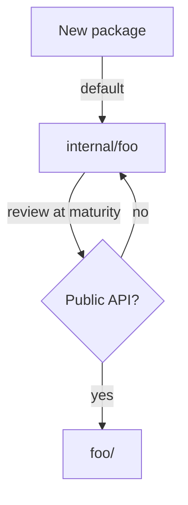

# Internal Packages — Junior

<!-- level-focus -->
At junior level, focus on this question:

> How can I apply **Internal Packages** in one small example and prove the result?

Use the smallest realistic scenario that exposes the decision and its failure behavior.
## Core Concepts

### The one rule

Read it twice; this is the whole feature:

> A package whose import path contains a path element named `internal` may only be imported by code rooted at the parent of that `internal` directory.

"Rooted at the parent of that `internal` directory" means: the import is allowed if and only if the importing file lives somewhere under that parent. Anything else is rejected.

### A worked example

```
myapp/
├── go.mod                  ← module myapp
├── main.go
├── handler/
│   └── handler.go
└── internal/
    └── auth/
        └── auth.go
```

The parent of `internal/` is `myapp/` (the module root). Anything under `myapp/` may import `myapp/internal/auth`:

- `myapp/main.go` — yes
- `myapp/handler/handler.go` — yes
- `myapp/internal/auth/auth_test.go` — yes

Anything outside `myapp/` may not. If a different module tries to import `myapp/internal/auth`, the build fails:

```
package someoneelse/cmd
        imports myapp/internal/auth: use of internal package myapp/internal/auth not allowed
```

### Multi-level `internal/`

`internal/` can sit deeper in the tree, restricting access more tightly:

```
myapp/
├── go.mod
├── handler/
│   ├── handler.go
│   └── internal/
│       └── parse/
│           └── parse.go
└── service/
    └── service.go
```

Now the parent of `internal/` is `myapp/handler/`. The rule says anything under `myapp/handler/` may import `myapp/handler/internal/parse`:

- `myapp/handler/handler.go` — yes
- `myapp/handler/middleware/cors.go` — yes (same subtree)
- `myapp/service/service.go` — **no**, even though both are inside the same module

This is how you make a package *private to one feature* instead of merely *private to the module*.

### What "the parent" really means

People are sometimes surprised by where the boundary lands. The rule says *the parent of the `internal` directory*. So:

- `myapp/internal/x` → parent is `myapp/`. The whole module sees `x`.
- `myapp/foo/internal/x` → parent is `myapp/foo/`. Only `foo` and its subtree see `x`.
- `myapp/foo/bar/internal/x` → parent is `myapp/foo/bar/`. Only `foo/bar` and its subtree see `x`.

One way to check: walk up from the `internal/` directory by one level. Anything *under* that level is allowed; anything else is not.

### `internal/` is a folder, not a keyword

There is no `internal` keyword in Go source. The mechanism is purely structural. You do not *declare* a package internal — you *place it* in a directory called `internal`. Renaming the directory removes the protection. Moving the directory changes the boundary.

This is unusual and worth letting sink in: visibility is a function of *where the file lives*, not of any annotation in the file itself.

### `internal/` does not affect identifier exports

Inside `myapp/internal/auth/auth.go`:

```go
package auth

func login(user string) {} // unexported identifier
func Login(user string) {} // exported identifier
```

The lowercase `login` is invisible to *anyone* — including other files in the same package's siblings — because of normal Go capitalisation rules. The uppercase `Login` is visible to anyone who is *allowed* to import `myapp/internal/auth`. The two rules compose: a symbol is reachable only if the importer is allowed to import the package *and* the symbol is exported by capitalisation.

---

## Code Examples

### Example 1 — Make a helper package internal

Start with a project that exposes too much:

```
hello/
├── go.mod                  ← module example.com/hello
├── main.go
└── helpers/
    └── helpers.go          ← package helpers
```

`helpers.go`:

```go
package helpers

import "strings"

// Title-cases a single word for greeting display.
func Capitalise(s string) string {
    if s == "" {
        return s
    }
    return strings.ToUpper(s[:1]) + s[1:]
}
```

Right now any other module can `import "example.com/hello/helpers"`. To prevent that, move it under `internal/`:

```
hello/
├── go.mod
├── main.go
└── internal/
    └── helpers/
        └── helpers.go
```

Update the import in `main.go`:

```go
package main

import (
    "fmt"

    "example.com/hello/internal/helpers"
)

func main() {
    fmt.Println(helpers.Capitalise("alice"))
}
```

Build it:

```bash
go build ./...
```

It works. Now the helper is hidden — no other module can pull it in.

### Example 2 — Watch the rule reject an outside importer

In a *different* module, try to import the previous helper:

`other/go.mod`:

```
module example.com/other

go 1.22
```

`other/main.go`:

```go
package main

import "example.com/hello/internal/helpers"

func main() {
    _ = helpers.Capitalise
}
```

Build:

```
$ go build ./...
main.go:3:8: use of internal package example.com/hello/internal/helpers not allowed
```

That is the message you will memorise. The compiler refuses, full stop.

### Example 3 — Sibling packages may both reach into `internal/`

```
hello/
├── go.mod
├── cmd/
│   └── greet/
│       └── main.go
├── server/
│   └── server.go
└── internal/
    └── auth/
        └── auth.go
```

Both `cmd/greet/main.go` and `server/server.go` may import `example.com/hello/internal/auth`. They are both rooted at `example.com/hello/`, which is the parent of `internal/`.

`server/server.go`:

```go
package server

import "example.com/hello/internal/auth"

func New() *Server {
    return &Server{auth: auth.New()}
}

type Server struct {
    auth *auth.Auth
}
```

`cmd/greet/main.go`:

```go
package main

import (
    "fmt"

    "example.com/hello/internal/auth"
)

func main() {
    fmt.Println(auth.Banner())
}
```

Both compile. Both are inside the parent of `internal/`.

### Example 4 — Multi-level `internal/` inside a feature

Now scope a helper package to *one feature*:

```
hello/
├── go.mod
├── handler/
│   ├── handler.go
│   └── internal/
│       └── parse/
│           └── parse.go
└── service/
    └── service.go
```

`handler/handler.go` may import `example.com/hello/handler/internal/parse`. `service/service.go` **may not** — even though they live in the same module.

```go
// handler/handler.go — OK
package handler

import "example.com/hello/handler/internal/parse"

func Handle() { parse.Header("X-Foo: 1") }
```

```go
// service/service.go — fails
package service

import "example.com/hello/handler/internal/parse"

func Use() { parse.Header("X-Foo: 1") }
```

Build:

```
service/service.go:3:8: use of internal package example.com/hello/handler/internal/parse not allowed
```

The boundary is now the `handler/` directory, not the module root.

### Example 5 — `internal/` inside a published library

A library `acme/parser` v1.0:

```
parser/
├── go.mod                  ← module github.com/acme/parser
├── parser.go               ← public API: Parse, Encode
├── doc.go
└── internal/
    ├── lexer/
    │   └── lexer.go
    └── ast/
        └── ast.go
```

`parser.go`:

```go
package parser

import (
    "github.com/acme/parser/internal/ast"
    "github.com/acme/parser/internal/lexer"
)

func Parse(input string) (*Tree, error) {
    tokens := lexer.Tokenise(input)
    node := ast.Build(tokens)
    return wrap(node), nil
}

type Tree struct{ root *ast.Node }
```

External users see only `Parse`, `Tree`, and the helpers exported from `parser.go`. They cannot import `lexer` or `ast` even if they really want to. The maintainers of `acme/parser` are free to rewrite, rename, or delete the internal packages without breaking a single consumer.

### Example 6 — Show the full error message

A CI log fragment from a failed build:

```
$ go build ./...
# example.com/other
./main.go:5:2: use of internal package example.com/hello/internal/helpers not allowed
```

The `# example.com/other` line is the importing package; the next line is the offence. No traceback, no location of `internal/` — just a plain rejection.

### Example 7 — `cmd/`-rooted internals (a common convention)

A repo with multiple binaries sharing internals only useful to the binaries:

```
project/
├── go.mod
├── cmd/
│   ├── api/
│   │   └── main.go
│   ├── worker/
│   │   └── main.go
│   └── internal/
│       └── flagutil/
│           └── flagutil.go
└── pkg/
    └── shared/
        └── shared.go
```

`cmd/internal/flagutil` is reachable only from anything under `cmd/`. The `pkg/shared` package — and any external consumer — cannot import it. This keeps CLI scaffolding distinct from re-usable library code.

### Example 8 — Tests are part of the same subtree

`internal/auth/auth_test.go` lives next to `auth.go`. It can import its sibling normally because the test file is *inside* the `internal/` subtree:

```go
// internal/auth/auth_test.go
package auth

import "testing"

func TestLogin(t *testing.T) {
    if !checkLogin("user", "pwd") {
        t.Fatal("expected ok")
    }
}
```

A black-box test using `package auth_test` in the same directory also works:

```go
// internal/auth/auth_blackbox_test.go
package auth_test

import (
    "testing"

    "example.com/hello/internal/auth"
)

func TestPublicAPI(t *testing.T) {
    _ = auth.Banner()
}
```

The black-box test imports `example.com/hello/internal/auth` from a file inside `example.com/hello/internal/auth/` — still inside the parent of `internal/`. Allowed.

---

## Coding Patterns

### Pattern 1 — `internal/` as a default for new packages

When you add a new package, *start* by placing it under `internal/`. Move it out only when you have decided it is part of the public API. This way the default is "private," which is almost always what a beginner wants.

```
project/
├── go.mod
└── internal/
    └── newthing/        ← starts here
        └── newthing.go
```

If, six months later, the team agrees `newthing` is genuinely re-usable, move it:

```
project/
├── go.mod
└── newthing/            ← promoted to public
    └── newthing.go
```

`go mod tidy` and a search-and-replace on the import path are usually all the migration that is needed.

**Diagram:**



**Remember:** `internal/` is the "I have not promised this yet" parking lot.

### Pattern 2 — One `internal/` at the module root

For a typical small or medium project, a single `internal/` directory at the module root is enough:

```
project/
├── go.mod
├── cmd/api/main.go
├── api/                    ← public
│   └── api.go
└── internal/
    ├── service/
    ├── repo/
    └── auth/
```

Everything under `internal/` is module-private. Everything outside is public. This is the most common shape and the easiest to reason about.

**Remember:** Most projects do not need multi-level `internal/`. Reach for it only when you want to limit visibility *inside* the module.

### Pattern 3 — Feature-scoped `internal/`

When a feature has helpers that nothing else in the module should touch, give it its own `internal/`:

```
project/
├── go.mod
├── handler/
│   ├── handler.go
│   └── internal/
│       └── parse/
│           └── parse.go
└── service/
    └── service.go
```

`service` cannot reach `parse`. The handler keeps its helpers truly local. This is rare in small projects, common in larger ones.

---

## Clean Code

### Naming

```go
// Bad — vague
package internal // (does not even compile; "internal" is reserved as a folder name only)

// Good — internal/ is the directory; the package keeps its real name
package auth     // file is in internal/auth/auth.go
package parse    // file is in handler/internal/parse/parse.go
```

**Rules:**
- Never name a *package* `internal`. The directory is named `internal`; the package inside has its real name.
- The package name should describe what the package *is*, not where it lives.

### File layout

```
project/
├── go.mod
├── doc.go            ← package-level doc comment for module root (if any)
├── api/              ← public API
├── cmd/              ← binaries
│   ├── server/
│   └── tool/
├── internal/         ← module-private
│   ├── service/
│   ├── repo/
│   └── auth/
└── README.md
```

Keep public packages at the top level; keep private ones under `internal/`. Resist the urge to nest `internal/` inside `internal/` "just in case" — flat is easier to read.

### Import grouping

Standard layout: standard library, blank line, third-party, blank line, local module:

```go
import (
    "context"
    "fmt"

    "github.com/google/uuid"

    "example.com/hello/internal/auth"
)
```

`gofmt` and `goimports` enforce the order. Internal imports look exactly like any other local import — no special prefix is added.

---

## Error Handling

There is no runtime error from `internal/`. The check is a *build-time* error from the toolchain. Recognise the two messages.

### "use of internal package ... not allowed"

```
./main.go:3:8: use of internal package example.com/foo/internal/x not allowed
```

**Why it happens:** an importing file lives outside the parent of `internal/`. Either you put the package in the wrong place, or you imported from the wrong file.

**How to fix:**

- Move the package out of `internal/` if it really is meant to be public.
- Move the importing file inside the allowed subtree.
- Or simply do not import it and use the public API instead.

### "cannot find package" / "no Go files"

If you mistype the import path:

```
./main.go:3:8: cannot find package "example.com/foo/internl/x" in any of:
        ...
```

**Why it happens:** typo in the path (`internl`), or the directory does not exist in the module.

**How to fix:** correct the path. Check the directory tree.

### Editor red squigglies

Sometimes `gopls` or the IDE flags the import before `go build` does. The error wording is the same. Save the file, run `go mod tidy`, restart the language server if the squigglies persist after fixing.

---

## Best Practices

1. **Default to `internal/`** for any new package whose purpose you have not yet decided. Promote later.
2. **One `internal/` at the module root** is enough for most projects. Reach for nested `internal/` only when you truly need feature-level scoping.
3. **Never name a package `internal`.** The directory is the magic; the package keeps its real, descriptive name.
4. **Treat your non-`internal/` packages as a contract.** Anything you publish is a promise. `internal/` is your safety net.
5. **Move, do not copy.** When promoting `internal/foo` to `foo/`, rename the directory and `gofmt` the imports — do not duplicate.
6. **Keep `cmd/` thin.** Use `cmd/<binary>/main.go` as a tiny entry point that wires up `internal/` packages. Logic belongs in `internal/`, not in `main`.
7. **Write a `doc.go` at the module root** describing what is public and what is internal, so newcomers see the boundary on day one.
8. **Use the rule, do not fight it.** If you find yourself trying to bypass `internal/` (with `vendor/`, with forks), stop and reconsider; the rule is telling you something.

---

## Edge Cases & Pitfalls

### Pitfall 1 — Putting `internal/` at the wrong depth

```
project/
└── internal/
    └── deep/
        └── internal/         ← redundant
            └── x/
                └── x.go
```

The inner `internal/` is allowed, but it limits visibility to `internal/deep/`'s subtree — usually narrower than you intended. Beginners sometimes nest `internal/` reflexively. Stop and ask: "is *deep* really the boundary I want?"

### Pitfall 2 — Naming your package `internal`

```go
// internal/auth/auth.go
package internal      // wrong
```

Now the package's identifier is `internal`, which makes call sites like `internal.Login(...)` confusing and ugly. The directory is `internal/auth/`; the package name should be `auth`. Always.

### Pitfall 3 — Using `internal/` as a security boundary

`internal/` prevents *imports*. It does not prevent *forking*, *vendoring*, or *patching*. Anyone who clones your repo can edit the source. Treat `internal/` as a build-time API decision, not a security mechanism.

### Pitfall 4 — Tests that black-box-import an `internal/` sibling

A test file in `package foo_test` inside `foo/` may import `foo` because the test still lives in `foo/`. But a test file in `bar/` that wants to test `foo`'s `internal/x` cannot import it — the test file lives outside the parent of `internal/`.

### Pitfall 5 — Vendored copies

If you `go mod vendor`, everyone's `internal/` packages get copied into your `vendor/` tree. They are still subject to the same rule when you build, but reading the source on disk can be confusing — *seeing* the file does not mean you are *allowed* to import it.

### Pitfall 6 — Forgetting that the rule depends on the import path, not the file location

```
project/
├── go.mod                     ← module example.com/project
└── work/
    └── internal/
        └── tool/
            └── tool.go
```

The path matters: `example.com/project/work/internal/tool` has `internal` as a path *element*. The toolchain enforces the rule against the import path, not the on-disk location of the source. They normally agree, but if you ever rename your module path, double-check you have not silently moved the boundary.

### Pitfall 7 — `pkg/internal/` vs `internal/pkg/`

These two trees look similar but differ in scope:

```
proj/pkg/internal/x/    ← parent of internal/ is proj/pkg/
proj/internal/pkg/x/    ← parent of internal/ is proj/
```

The first restricts to `pkg/`'s subtree. The second restricts only to "the module" — every package in `proj/` may import it. Lay out deliberately.

### Pitfall 8 — Type identity across `internal/`

If two different modules each have an `internal/foo` package with a `type Bar` and you somehow get them both into the same binary (rare, requires forks or weird `replace` setups), the two `Bar`s are distinct types — Go identifies types by their full import path. `internal/` does not change identity rules; it only restricts who may import.

---

## Common Mistakes

- **Naming a package `internal`.** The directory is `internal`; the package keeps its descriptive name.
- **Adding `internal/` only at the deepest possible level "to be safe."** Often you accidentally exclude legitimate callers in your own module.
- **Promoting an `internal/` package by *copying* the source instead of *moving*.** Two copies drift; one becomes stale.
- **Using `internal/` to "discourage" use of a package.** It is not a soft hint; it is a hard rule. Either you mean it or you do not.
- **Treating `internal/` as encryption.** Source is still readable. Do not put secrets there.
- **Forgetting to update import paths after moving a package in or out of `internal/`.** A search-and-replace on the import path is part of the move.
- **Using `internal/` to hide *symbols*.** Use lowercase identifiers for that. `internal/` hides whole packages, not individual functions.
- **Nesting `internal/` inside `internal/`.** It is legal but almost always pointless.

---

## Common Misconceptions

> *"`internal/` is a Go keyword."*

No. It is a directory name. There is no syntax change, no annotation, no metadata. The check is implemented by the toolchain.

> *"`internal/` packages are encrypted or hidden on disk."*

No. The source files are plain Go, plain text, in the repo. Anyone who clones the repo sees them. The rule only controls *importing*.

> *"You can't write tests for `internal/` packages."*

You can. Tests inside the same directory are part of the subtree and import normally. White-box tests use the same `package`; black-box tests use `package x_test` and import the package by its full path.

> *"`internal/` was always part of Go."*

No. It was added in Go 1.4 as an experimental feature and made permanent in Go 1.5. Go 1.0–1.3 had no language-level mechanism for hiding packages from outside modules.

> *"`internal/` works only for libraries."*

It works for any module. Applications, libraries, mono-repos — wherever a module exists, the rule applies.

> *"Using `internal/` is a smell."*

The opposite. A library with no `internal/` is usually one that has accidentally exposed its implementation. A small public surface plus a fat `internal/` is healthy.

---

## Tricky Points

- **The rule is enforced by `cmd/go`, not the language spec.** The Go *language* specification says nothing about `internal/`. The *modules and build* documentation is where it lives.
- **`internal/` matches as a path *element*, not a substring.** A directory called `myinternal` or `internalstuff` is *not* magical — only an exact element named `internal`.
- **There can be more than one `internal/` in a path.** Each acts as its own boundary. `a/internal/b/internal/c` is reachable only by code under `a/internal/b/`.
- **`internal/` is independent of `vendor/`.** A vendored copy is still treated as the same package; the rule applies the same way.
- **`go.work` does not relax the rule.** Adding several modules to a workspace does not let one module reach into another's `internal/`.
- **`replace` does not relax the rule.** Even if you `replace` an `internal/` path with your own copy, importers outside the parent are still rejected.
- **`internal/` rejection is at *build* time, not *parse* time.** The file parses fine; the package list resolves; only when the importer is checked against the path does the error fire.

---

## Apply it

1. Choose one small, known input for **Internal Packages**.
2. Predict the output or observable behavior.
3. Run the smallest example or probe that exercises the concept.
4. Change one input to trigger a failure or boundary case.
5. Explain the evidence using the guide's vocabulary.

## Verify your work

- Record the exact input, command or code path, and output.
- Repeat the probe and confirm the result is consistent.
- Show one expected success and one expected failure.
- Resolve any difference between the prediction and the evidence.

## Review questions

- What problem does Internal Packages solve in the example?
- Which input changes the observed result, and why?
- What is the smallest useful success check?
- Which beginner mistake would your evidence catch?
