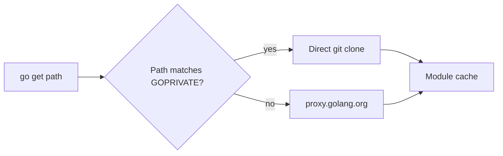

# Private Modules — Junior

<!-- level-focus -->
At junior level, focus on this question:

> How can I apply **Private Modules** in one small example and prove the result?

Use the smallest realistic scenario that exposes the decision and its failure behavior.
## Core Concepts

### `GOPRIVATE` is a glob list, not a URL list

`GOPRIVATE` does not store hostnames or repos — it stores **module paths**. A module path is what you write after `module` in `go.mod`. For example:

```
module github.com/acme-corp/internal-auth
```

The path here is `github.com/acme-corp/internal-auth`. To mark every module under your org as private:

```bash
go env -w GOPRIVATE=github.com/acme-corp/*
```

The `*` is a glob (one path segment). For multiple orgs, separate by comma:

```bash
go env -w GOPRIVATE=github.com/acme-corp/*,gitlab.acme.com/*
```

Note that `gitlab.acme.com/*` covers an entire host's worth of repos in one entry.

### Two things `GOPRIVATE` actually toggles

For module paths matching the glob, the toolchain:

1. Sets the effective `GONOPROXY` to include them — meaning it will not ask `proxy.golang.org`. It uses the `direct` fetcher (Git over HTTPS or SSH).
2. Sets the effective `GONOSUMDB` to include them — meaning it will not call `sum.golang.org` to verify their checksum.

Everything else still happens normally: `go.mod` and `go.sum` are still updated, hashes are still stored, builds are still reproducible. The only thing skipped is the *public* infrastructure that has no business knowing about your private code.

### `go` does not authenticate; `git` does

There is no `GOUSER` or `GOPASSWORD`. The Go toolchain shells out to `git` for the `direct` fetcher. Whatever auth your `git clone` command would use, `go` will use the same. If `git clone https://github.com/acme-corp/internal-auth` works in your terminal, `go get github.com/acme-corp/internal-auth` will work too.

This is sometimes confusing because you might run `gh auth login` (the `gh` CLI helper) and assume Go inherits that. It does not — `gh auth login` configures the `gh` CLI, not `git`. To make `git` use the same credential, use `gh auth setup-git` or set up `.netrc` / a PAT manually.

### HTTPS vs SSH — pick one and be consistent

Two ways to authenticate `git` to GitHub or GitLab:

- **HTTPS + PAT.** You create a token in GitHub, then `git clone https://github.com/acme-corp/repo` is given the token as the password. Works in CI, easy to revoke per-token.
- **SSH key.** You generate `~/.ssh/id_ed25519`, paste the public half into GitHub, then `git clone git@github.com:acme-corp/repo` works. Painful to set up in CI; ergonomic locally.

Go uses whichever you set up. To force HTTPS even when a colleague's `go.mod` references SSH, you can rewrite the URL globally in your Git config:

```bash
git config --global url."https://github.com/".insteadOf "git@github.com:"
```

Or the reverse (HTTPS to SSH):

```bash
git config --global url."git@github.com:".insteadOf "https://github.com/"
```

### `go env` vs shell exports

Two equivalent ways to set `GOPRIVATE`:

```bash
# Method A: persistent, written to ~/.config/go/env
go env -w GOPRIVATE=github.com/acme-corp/*

# Method B: per-shell session
export GOPRIVATE=github.com/acme-corp/*
```

`go env -w` is convenient on a workstation. `export` is mandatory in CI scripts or Docker images, where `~/.config/go/env` is not present or not preserved.

To inspect:

```bash
$ go env GOPRIVATE
github.com/acme-corp/*
```

To clear:

```bash
go env -u GOPRIVATE
```

---

## Code Examples

### Example 1: First time enabling `GOPRIVATE`

Suppose you have a private repo at `github.com/acme-corp/internal-auth` and a fresh project that needs to import it.

```bash
# Step 1 — your terminal can already clone the repo
$ git clone https://github.com/acme-corp/internal-auth /tmp/check
Cloning into '/tmp/check'...
remote: Enumerating objects: 42, done.

# Step 2 — tell Go about the private path
$ go env -w GOPRIVATE=github.com/acme-corp/*

# Step 3 — try the import in a fresh module
$ mkdir -p /tmp/playground && cd /tmp/playground
$ go mod init demo
go: creating new go.mod: module demo

$ cat > main.go <<'EOF'
package main

import (
    "fmt"

    auth "github.com/acme-corp/internal-auth"
)

func main() {
    fmt.Println(auth.Hello())
}
EOF

$ go mod tidy
go: finding module for package github.com/acme-corp/internal-auth
go: downloading github.com/acme-corp/internal-auth v0.3.1
go: found github.com/acme-corp/internal-auth in github.com/acme-corp/internal-auth v0.3.1

$ go run .
hello from internal-auth v0.3.1
```

**What it does:** flips `GOPRIVATE`, lets `git` use whatever credentials are already in your shell, and adds a private dep with no special syntax in the import line.
**How to run:** every command above, in order, from a terminal.

---

### Example 2: Setting `GOPRIVATE` in a single shell session

If you do not want to persist the setting (a quick experiment, a CI job):

```bash
export GOPRIVATE="github.com/acme-corp/*,gitlab.acme.com/*"
go get github.com/acme-corp/internal-auth@latest
```

The variable lives only for that shell. Open a new terminal and it is gone.

---

### Example 3: Configuring HTTPS with a PAT via `.netrc`

Create a token in **GitHub → Settings → Developer settings → Personal access tokens → Tokens (classic)** with the `repo` scope. Then:

```bash
$ cat >> ~/.netrc <<'EOF'
machine github.com
  login your-username
  password ghp_AbCdEf1234567890
EOF

$ chmod 600 ~/.netrc

$ go get github.com/acme-corp/internal-auth@latest
go: downloading github.com/acme-corp/internal-auth v0.3.1
```

`git`'s HTTPS layer reads `~/.netrc` and uses the token as the password.

> Note: GitHub fine-grained tokens work too. Be sure to grant **Contents: read** on the repo or org.

---

### Example 4: Configuring SSH

If you already have an SSH key:

```bash
$ ssh -T git@github.com
Hi your-username! You've successfully authenticated, but GitHub does not provide shell access.
```

To force Go's `direct` fetcher to use SSH for GitHub:

```bash
git config --global url."git@github.com:".insteadOf "https://github.com/"
```

Now any tool — `go get` included — that tries to clone an `https://github.com/...` URL will silently rewrite to `git@github.com:...`.

---

### Example 5: Pinning a specific commit on a private branch

You need a feature that has not been tagged. Pin to a commit SHA the same way you would for a public repo:

```bash
$ go get github.com/acme-corp/internal-auth@feature/oauth
go: downloading github.com/acme-corp/internal-auth v0.0.0-20250508121314-1a2b3c4d5e6f
```

The toolchain rewrites the branch name to a pseudo-version. The branch must still exist for the SHA to remain resolvable later.

---

### Example 6: Using `go list -m` against a private module

Once configured, all the regular tools work on private modules:

```bash
$ go list -m -versions github.com/acme-corp/internal-auth
github.com/acme-corp/internal-auth v0.1.0 v0.2.0 v0.3.0 v0.3.1

$ go list -m -u github.com/acme-corp/internal-auth
github.com/acme-corp/internal-auth v0.3.1 [v0.4.0]
```

The `[v0.4.0]` brackets mean "newer is available." This is identical UX to public deps.

---

### Example 7: A complete `go env` snapshot for a private setup

```bash
$ go env GOPRIVATE GONOPROXY GONOSUMDB GOPROXY GOSUMDB
github.com/acme-corp/*
github.com/acme-corp/*
github.com/acme-corp/*
https://proxy.golang.org,direct
sum.golang.org
```

Notice that even though you only explicitly set `GOPRIVATE`, the toolchain reports `GONOPROXY` and `GONOSUMDB` derived from it.

---

## Coding Patterns

### Pattern 1: Per-org GOPRIVATE entry

**Intent:** mark every repo your organisation owns as private with one glob.
**When to use:** any team that hosts internal Go modules in a single GitHub org or GitLab group.

```bash
# All of acme-corp on GitHub
go env -w GOPRIVATE='github.com/acme-corp/*'

# All of acme-corp + a self-hosted GitLab
go env -w GOPRIVATE='github.com/acme-corp/*,gitlab.acme.io/*'
```

**Diagram:**



**Remember:** glob matches *module paths*, which usually start with the host. The host name is the easy way to scope.

---

### Pattern 2: Project-local `.envrc` so teammates don't fight `GOPRIVATE`

**Intent:** keep `GOPRIVATE` per-project so a contributor's other Go work is unaffected.

```bash
# .envrc (used by direnv)
export GOPRIVATE="github.com/acme-corp/*"
```

When you `cd` into the project, `direnv` exports the variable; when you leave, it unsets it.

**Remember:** `go env -w` is global to your user. `.envrc` (or a project script) keeps the setting scoped.

---

## Clean Code

### Naming

```go
// Bad — opaque
import "github.com/acme-corp/auth"

// Better — alias when shadowed by stdlib
import auth "github.com/acme-corp/internal-auth"
```

If your private module's last path segment collides with a standard library package or another import (`auth`, `log`, `errors`), alias it.

---

### `go.mod` hygiene

A private dep looks identical to a public one in `go.mod`. There is no special syntax. Do not add comments hinting at privacy — the `GOPRIVATE` env var carries that information.

```
require (
    github.com/acme-corp/internal-auth v0.3.1
    github.com/google/uuid             v1.6.0
)
```

---

### Configuration files

- `~/.netrc` — chmod 600. Owner-only readable.
- `~/.ssh/id_ed25519` — chmod 600. Never check into git.
- `~/.config/go/env` — written by `go env -w`. Safe to inspect, do not commit.

---

## Error Handling

The most common errors you will see, what they mean, and the first thing to try:

| Symptom | Probable cause | First fix |
|---------|---------------|-----------|
| `410 Gone` | `GOPRIVATE` not set; proxy returned "I don't have it." | `go env -w GOPRIVATE=<glob>` |
| `unrecognized import path` | Path typo *or* the proxy returned `404`. | Check spelling; check `GOPRIVATE`. |
| `terminal prompts disabled` | Running in CI; `git` has no creds. | Set `.netrc` or `GIT_ASKPASS` in CI. |
| `verifying ...: checksum mismatch` | `go.sum` was hand-edited or upstream re-tagged. | Restore `go.sum` from git; `go mod tidy`. |
| `unknown revision <branch>` | Branch was deleted or you typoed it. | `git ls-remote <repo>` to confirm. |
| `Permission denied (publickey)` | SSH key not loaded into agent. | `ssh-add ~/.ssh/id_ed25519`. |

A heuristic: if the error mentions `proxy.golang.org`, the toolchain is *not* treating the path as private — fix `GOPRIVATE`. If it mentions Git or SSH, the routing is right but auth is wrong — fix `git` config.

---

## Security Considerations

- **Tokens leak through env vars.** Avoid logging your shell environment in CI. Pipelines like GitHub Actions automatically mask known secrets, but `printenv` in a script can still defeat that.
- **Public sumdb is bypassed for private modules.** That is the whole point — but you lose the supply-chain safety net. For private code you control end-to-end this is fine. For private *forks* of public modules, set up an internal proxy that records hashes (see senior level).
- **`.netrc` is plaintext.** Set `chmod 600` and consider whether you should be using an OS keyring instead (macOS Keychain, libsecret on Linux). Tools like `git-credential-osxkeychain` do this transparently.
- **PAT scopes.** Use the *minimum* scope that lets `git` clone — typically `repo: read` on GitHub. Do not reuse a PAT that also has `delete_repo`.
- **Force-pushed branches.** If you depend on a pseudo-version pointing at a branch tip and someone force-pushes, the SHA is gone and your build is gone. Always pin to tags or stable branches.

---

## Performance Tips

- The first `go get` of a private module is slowest (full clone). Subsequent fetches use the module cache.
- Shallow clones reduce time but Go does not let you configure clone depth — set up an internal proxy if your team feels this pain (senior level).
- If `go.sum` is healthy and the module cache is warm, even a fresh CI checkout can resolve private deps in milliseconds — no Git round-trip needed. Cache `~/go/pkg/mod` between CI runs.

---

## Best Practices

- **Set `GOPRIVATE` per-host, not per-repo.** Maintenance is easier.
- **Document the variable in your `README.md`.** New hires will reach for it.
- **Use the same auth method as the rest of the team.** If the team uses SSH, do not be the lone HTTPS user — you will hit edge cases nobody else can reproduce.
- **Pin tags, not branches.** Tags are immutable; branches are not.
- **`go mod tidy` after every dependency change.** Same as public modules.
- **Cache `~/go/pkg/mod` in CI.** Even private modules are immutable once downloaded.

---

## Edge Cases & Pitfalls

- **`GOPRIVATE` glob too tight.** `github.com/acme-corp/foo` only matches that *exact* path. To cover sub-modules, use `github.com/acme-corp/*`.
- **`GOPRIVATE` glob too loose.** `github.com/*` would mark *all* GitHub modules as private. The toolchain stops verifying their checksums, which is bad for security.
- **Path case-sensitivity.** Module paths are case-insensitive in Go's lookup but the canonical form preserves case. If your repo is `github.com/Acme-Corp/Foo`, your import must match.
- **CI clones the repo with `actions/checkout` but not the dep.** That is fine — you still need `GOPRIVATE` and a token configured for the *dependency's* host.
- **`go install` of a private CLI.** Same rules apply. `GOPRIVATE` and Git auth must be set.
- **Replace directives override `GOPRIVATE`.** `replace github.com/acme/foo => /tmp/foo` short-circuits the fetch; nothing private about it then.

---

## Common Mistakes

1. Confusing `GOPROXY=off` with `GOPRIVATE`. `GOPROXY=off` disables fetching entirely; `GOPRIVATE` only redirects fetching for matching paths.
2. Setting `GOPRIVATE` to a URL like `https://github.com/acme-corp/*`. It must be a *module path*, no scheme.
3. Forgetting to `chmod 600 ~/.netrc`. Some `git` configs refuse to read world-readable netrc files.
4. Hard-coding a PAT in a shell script committed to git.
5. Setting `GOPRIVATE` but leaving a tag-less import; the build then fails because `git` cannot resolve a missing branch.
6. Running `git clone` once successfully, then running `go get` from a different shell where SSH agent is missing.

---

## Common Misconceptions

- *"I have to use Athens to use private modules."* No. Athens is one of several solutions; for a small team, plain `GOPRIVATE` + Git auth is enough.
- *"`GOPRIVATE` makes my code private."* No. Your code is private because the *repo* is private. `GOPRIVATE` only changes how Go reaches it.
- *"`go.sum` doesn't apply to private modules."* It does. The hashes are still computed and verified — just not against `sum.golang.org`.
- *"I need a different `import` path for private modules."* No. The import is just `github.com/your-org/repo`, identical to a public module.
- *"`GOPRIVATE` is dangerous."* Properly scoped, it is benign. Setting it to `*` would be reckless; setting it to your org is correct.

---

## Tricky Points

- **`GOPRIVATE` only kicks in on a fresh fetch.** If a module is already in the cache, the toolchain reuses it regardless. Setting `GOPRIVATE` after a failed fetch sometimes still fails until you `go clean -modcache` or `rm -rf ~/go/pkg/mod/cache/download/<bad-path>`.
- **`go get` uses `git` for HTTPS, but `git` may use the system keyring.** On macOS, `git-credential-osxkeychain` is enabled by default; the very first `go get` may pop a system password dialog that you would not see on Linux.
- **`GIT_TERMINAL_PROMPT=0`.** In CI, set this to make `git` fail fast instead of hanging on a missing credential.
- **Globs are not regexes.** `*` matches one path *segment*, not arbitrary characters. `github.com/acme-*` does not match `github.com/acme-corp/foo`. Use `github.com/acme-corp/*` instead.
- **`GOFLAGS=-insecure` is a footgun.** It allows HTTP and skips TLS verification. Almost always the wrong tool. Investigate the real auth or proxy issue.

---

## Apply it

1. Choose one small, known input for **Private Modules**.
2. Predict the output or observable behavior.
3. Run the smallest example or probe that exercises the concept.
4. Change one input to trigger a failure or boundary case.
5. Explain the evidence using the guide's vocabulary.

## Verify your work

- Record the exact input, command or code path, and output.
- Repeat the probe and confirm the result is consistent.
- Show one expected success and one expected failure.
- Resolve any difference between the prediction and the evidence.

## Review questions

- What problem does Private Modules solve in the example?
- Which input changes the observed result, and why?
- What is the smallest useful success check?
- Which beginner mistake would your evidence catch?
