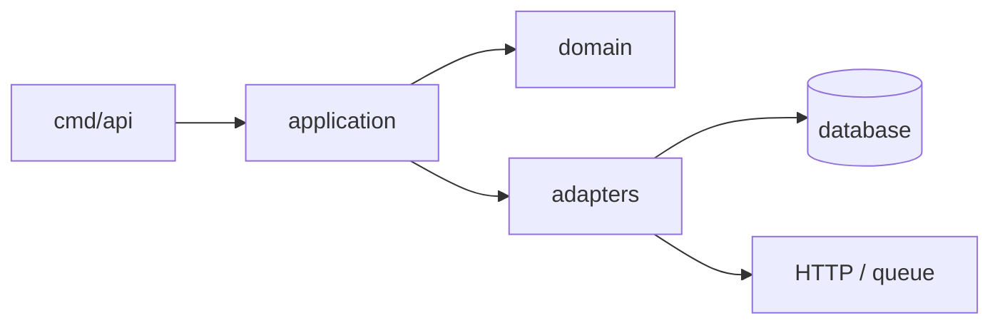

# Go Code Organization

Good Go projects are easy to enter, change, test, and deploy. The goal is not a fashionable folder tree. The goal is to make it obvious where a change belongs and to keep dependencies pointing in one direction.

## The practical model



- `cmd/` starts a binary and wires dependencies. Keep it small.
- A package owns one clear capability, not a technical layer with vague names such as `utils` or `common`.
- `internal/` protects implementation packages from imports outside the module.
- `go.mod` records the module and its direct dependencies; commit `go.sum`.
- Start with few packages. Split only when code has a distinct responsibility, owner, or rate of change.

## Choose the level you need

- [Junior](junior.md): make a small service understandable.
- [Middle](middle.md): design package boundaries and dependencies.
- [Senior](senior.md): organize a growing system without accidental coupling.
- [Professional](professional.md): set organization standards across repositories and teams.

## A useful default

```text
my-service/
├── cmd/api/main.go       # composition root
├── internal/user/        # user use cases and domain rules
├── internal/platform/    # shared infrastructure owned by this service
├── migrations/
├── go.mod
└── go.sum
```

This is a starting point, not a template to copy blindly. Let the business capabilities in the repository decide the package names.
