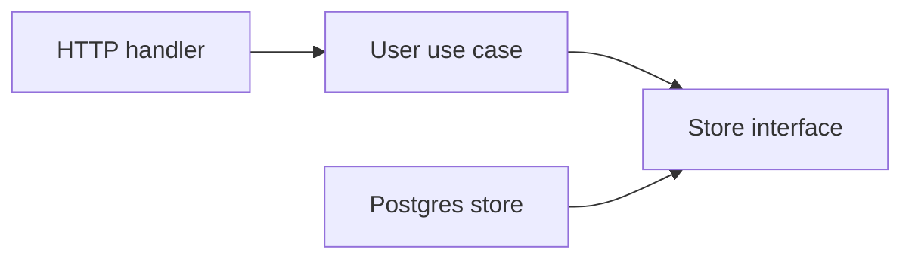

# Go Code Organization — Middle

At this level, optimize for safe change. The important decision is the package boundary, not the number of folders.

## Organize around capabilities

Prefer a package that owns a business capability:

```text
internal/
├── user/        # registration, profile, authentication rules
├── billing/     # invoices and payment workflow
└── notification/# sending notifications
```

Avoid a top-level `models/`, `services/`, or `utils/` package that every feature imports. Those become shared dumping grounds and make unrelated changes collide.

## Keep dependencies inward

The HTTP and database layers are details. Business rules should not import either one directly.



Define a small interface where it is consumed, not in a generic package:

```go
package user

type Repository interface {
	FindByEmail(ctx context.Context, email string) (User, error)
	Save(ctx context.Context, user User) error
}
```

The Postgres implementation can satisfy this interface without the `user` package importing Postgres.

## Use `internal` deliberately

Use `internal/` for packages that are implementation details of this module. Go prevents outside modules from importing them.

```text
cmd/api/main.go
internal/user/service.go
internal/postgres/user_repository.go
```

Do not use `internal` to hide unclear design. It protects a boundary; it does not create one.

## Manage dependencies simply

- Add a dependency with `go get example.com/lib@version`.
- Run `go mod tidy` after changing imports.
- Review new direct dependencies like production code: maintenance, license, security, and API fit matter.
- Prefer the standard library when it is adequate.

## Refactor signals

Split a package when it has unrelated reasons to change, needs a separate test setup, or has a stable API used by several callers. Do not split just because a file is long—first use better file names inside the same package.
