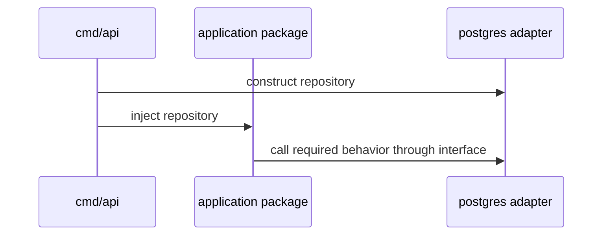

# Go Code Organization — Senior

For a growing Go system, code organization is an architecture decision. It should make ownership, dependency direction, and deployment boundaries visible.

## Protect the composition root

Only the composition root should know concrete infrastructure choices.

This keeps use cases testable and lets infrastructure evolve without spreading vendor types through the system.

## Choose boundaries by change and ownership

Keep code together when it is deployed, owned, and changed together. Create a separate module or service only when the boundary has real operational value: independent release cadence, access control, reliability needs, or a clear owner.

Multiple modules or a Go workspace can help local development, but they add versioning and dependency-graph cost. A modular monolith is often the better first architecture.

## Treat public packages as contracts

For code imported outside its package or module:

- expose constructors and behavior, not mutable internals;
- use package documentation and examples;
- avoid leaking database, HTTP, or framework types into the API;
- make breaking changes intentionally and version published modules with semantic versions.

`internal/` is a useful default for application code. Promote a package to public only when you are willing to support it.

## Control dependency risk

Use `go mod tidy` in CI and review dependency updates. For private modules, configure `GOPRIVATE` so Go does not query public proxies or checksum services for private paths. Pinning a version improves repeatability; it does not replace vulnerability scanning, provenance checks, or upgrade policy.

## A review checklist

- Can a newcomer identify the capability that owns this change?
- Does any domain package import a transport, ORM, or vendor SDK unnecessarily?
- Is an interface small and owned by its consumer?
- Did a shared package become a dependency magnet?
- Could this be one package with better files instead of a new abstraction?
