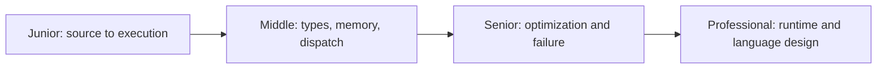
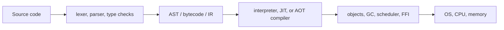

# Language Internals

> Language internals turn “the program behaves strangely” into a concrete question about representation, execution, memory, types, or the runtime.

## What matters most

The old track separated every mechanism into its own deep folder. This version keeps the ideas that most often change engineering decisions:

- how source becomes executable work;
- how values are represented and dispatched;
- how stacks, heaps, ownership, reference counting, and tracing GC differ;
- how static and dynamic type systems prevent different classes of mistakes;
- how interpreters, bytecode VMs, JITs, and native compilers trade startup for throughput;
- where Unicode, numeric representation, ABIs, and FFI create boundary bugs;
- how to choose a language using workload and operational evidence.

## Topics

Each topic keeps one overview and four progressive guides. Start with the mechanism behind the problem you are investigating.

| Topic | Main question |
|---|---|
| [Choosing a Language](choosing-a-language/README.md) | Which language best fits the workload, team, and operating model? |
| [Compilers and Interpreters](compilers-and-interpreters/README.md) | How does source become executable behavior? |
| [Data Representation and Numerics](data-representation-and-numerics/README.md) | How do bits, numbers, text, and objects encode meaning? |
| [Evaluation and Execution Models](evaluation-and-execution-models/README.md) | When and in what order does computation happen? |
| [FFI and Interoperability](foreign-function-interface-and-interop/README.md) | How can runtimes exchange calls and data safely? |
| [Language Security](language-security-internals/README.md) | Which mechanisms prevent memory, control-flow, isolation, and side-channel failures? |
| [Memory Management](memory-management/README.md) | Who owns memory and when can it be reclaimed? |
| [Metaprogramming](metaprogramming/README.md) | When should code inspect or generate code? |
| [Runtime Systems](runtime-systems/README.md) | How do dispatch, JITs, GC, loading, and unwinding work together? |
| [Type Systems](type-systems/README.md) | Which invalid states can the language reject before execution? |

## Practice rule

For every claim, find evidence at the closest useful layer: an AST dump, bytecode listing, compiler diagnostic, allocation profile, GC trace, machine-code view, or benchmark. Never use “compiled is fast” or “GC is slow” as an explanation.

## Related

- [Python](../python/README.md)
- [Go](../golang/README.md)
- [Programming Languages](../README.md)
