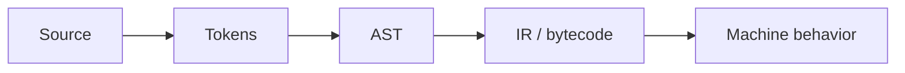

# Compilers and Interpreters

> A compiler is a pipeline of meaning-preserving transformations; an interpreter is an execution strategy, not the opposite of compilation.

| Level | Focus |
|---|---|
| [Junior](junior.md) | Tokens, syntax, AST, execution |
| [Middle](middle.md) | Semantic analysis, IR, optimization |
| [Senior](senior.md) | correctness, diagnostics, deoptimization |
| [Professional](professional.md) | real compiler pipelines and operations |

Practice: inspect the AST and bytecode or assembly of one small function.
