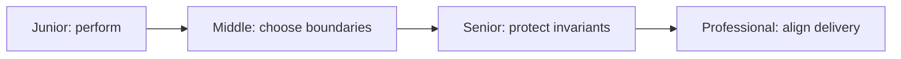

# Endianness & Byte Order

> Build practical capability in Endianness & Byte Order through four levels of increasing scope, ambiguity, and responsibility.

The levels form one path. Start where the actions are unfamiliar and move forward when you can produce the required evidence without copying the example.

## Choose a level

| Level | Guide | You are done when |
|---|---|---|
| Junior | [Start with a small example](junior.md) | You can run the method and explain one success and one failure. |
| Middle | [Make a local design decision](middle.md) | You can compare choices and verify the integrated boundary. |
| Senior | [Shape the system](senior.md) | You can protect invariants and test recovery under failure. |
| Professional | [Lead durable delivery](professional.md) | You can align ownership, rollout, measures, and exit conditions. |

## Practice rule

Use a real input, predict the result, run the smallest useful probe, and keep the evidence. A definition you cannot use to predict behavior is not yet an operational mental model.
