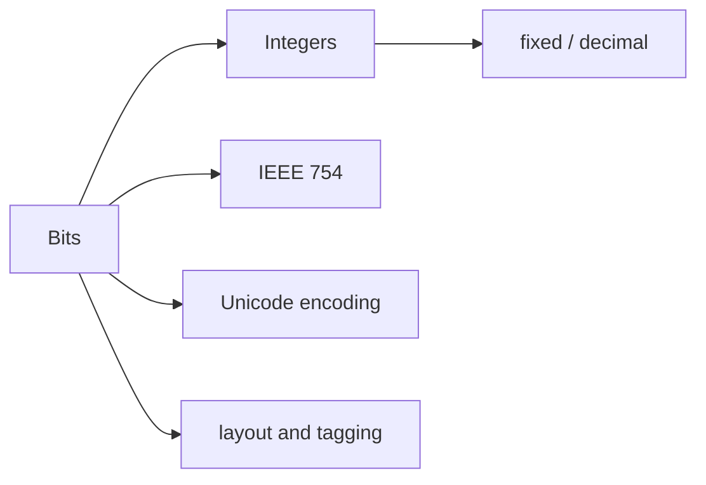

# Data Representation and Numerics

> Bits have no meaning until a representation, range, byte order, and encoding give them one.

Study [junior](junior.md), [middle](middle.md), [senior](senior.md), then [professional](professional.md). Practice by encoding one value and inspecting its bytes.
