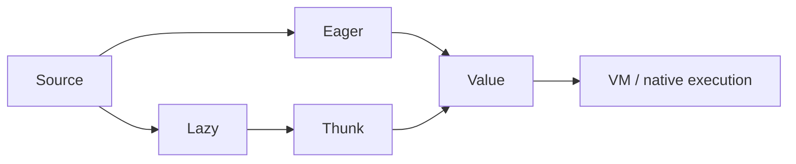

# Evaluation and Execution Models

> Evaluation strategy determines when expressions run, in what order, and how effects become visible.

Progress through [junior](junior.md), [middle](middle.md), [senior](senior.md), and [professional](professional.md). Practice by predicting side-effect order before running code.
