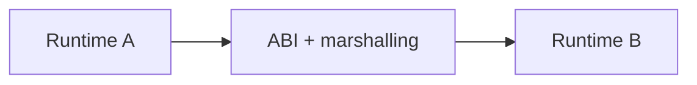

# FFI and Interoperability

> Crossing a runtime boundary requires agreement on calls, layout, ownership, errors, and threads.

Follow [junior](junior.md), [middle](middle.md), [senior](senior.md), and [professional](professional.md). Practice with one buffer whose allocator and lifetime are explicit.
