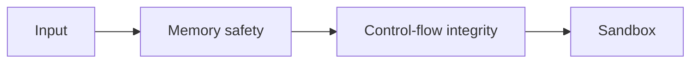

# Language Security Internals

> Security mechanisms reduce classes of failure; none replaces a threat model.

Progress through [junior](junior.md), [middle](middle.md), [senior](senior.md), and [professional](professional.md).
