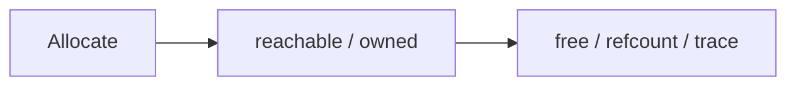

# Memory Management

> Memory management answers who owns storage, how long it lives, and what proves it is safe to reclaim.

Study [junior](junior.md), [middle](middle.md), [senior](senior.md), and [professional](professional.md). Practice with an allocation profile before tuning.
