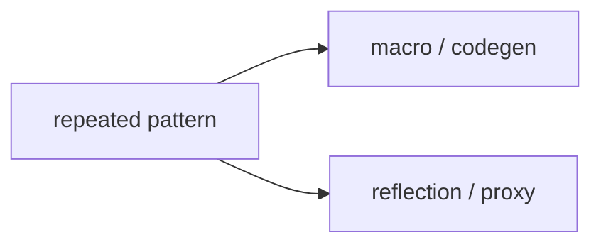

# Metaprogramming

> Generate or inspect code only when the removed repetition is worth the hidden execution model.

Follow [junior](junior.md), [middle](middle.md), [senior](senior.md), and [professional](professional.md).
