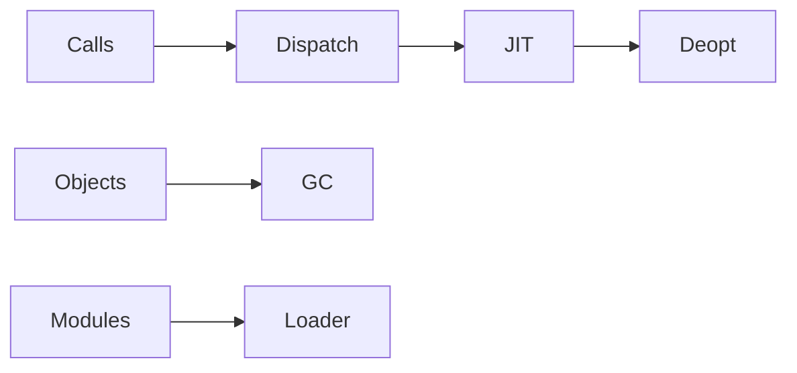

# Runtime Systems

> The runtime implements object layout, calls, loading, allocation, scheduling, exceptions, and optimization beneath source code.

Progress through [junior](junior.md), [middle](middle.md), [senior](senior.md), and [professional](professional.md).
