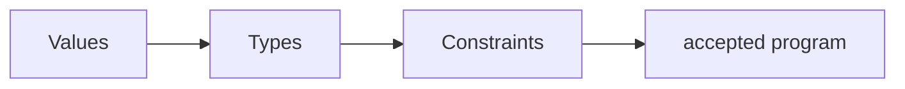

# Type Systems

> A type system is a proof tool for ruling out selected invalid programs—not a proof that the program is correct.

Study [junior](junior.md), [middle](middle.md), [senior](senior.md), and [professional](professional.md).
