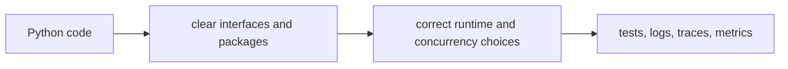

# Python Engineering

This track is about writing Python that stays understandable and reliable after it leaves a notebook or script.

Study each topic at the level of responsibility you have today. The goal is practical evidence: a test, profile, trace, or production signal that proves your design behaves as expected.

| Topic | Main question |
|---|---|
| Runtime | What does CPython execute, allocate, and share? |
| Interfaces | How do types, protocols, and APIs stay easy to use? |
| Code organization | Where should a change live? |
| Errors | How do failures remain useful and safe? |
| HTTP APIs | How do services validate, evolve, and operate endpoints? |
| Concurrency | Which work is async, threaded, or process-based? |
| Data systems | How do data access and distributed failure shape code? |
| Debugging | How do you turn a symptom into evidence and a fix? |
