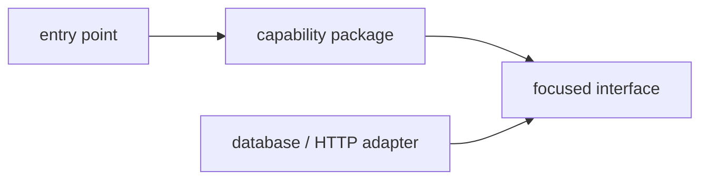

# Python Code Organization

> Put a change where its responsibility, dependencies, tests, and owner are easiest to understand.

Study [small project layout](junior.md), [capability boundaries](middle.md), [dependency direction](senior.md), and [organization-wide standards](professional.md). Practice by tracing one feature from entry point to external dependency.
