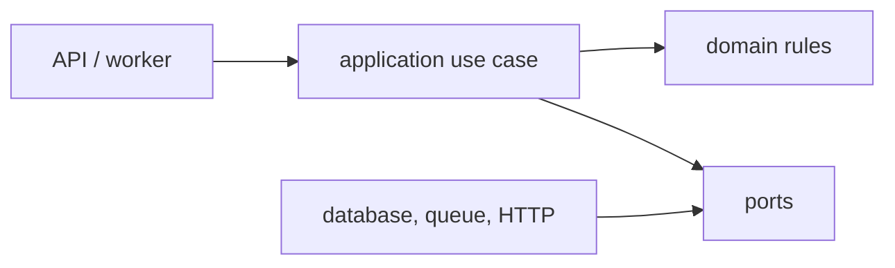

# Python Code Organization — Senior

Architecture should make dependency direction visible.

The composition root wires concrete adapters. Domain rules do not import a web framework or ORM. Split a package only when ownership, release cadence, or a stable boundary requires it.
