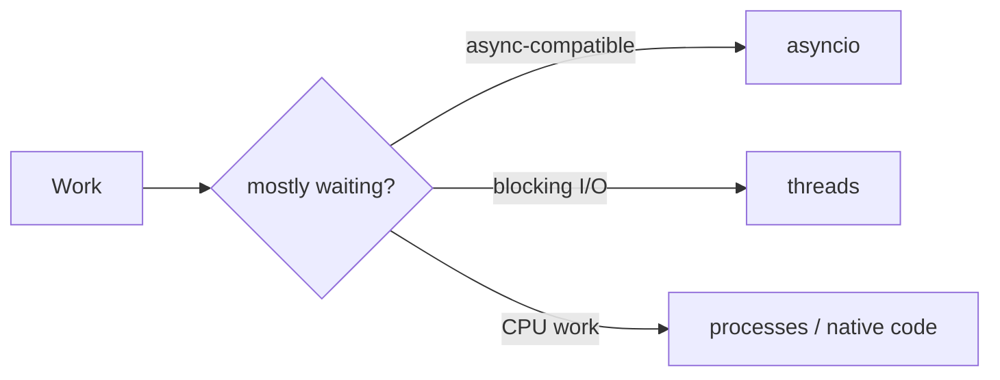

# Python Concurrency, Async, and Parallelism

> Choose concurrency from the workload, then bound tasks, queues, time, and shared state.

Progress through [safe basics](junior.md), [model selection](middle.md), [saturation behavior](senior.md), and [capacity governance](professional.md).
