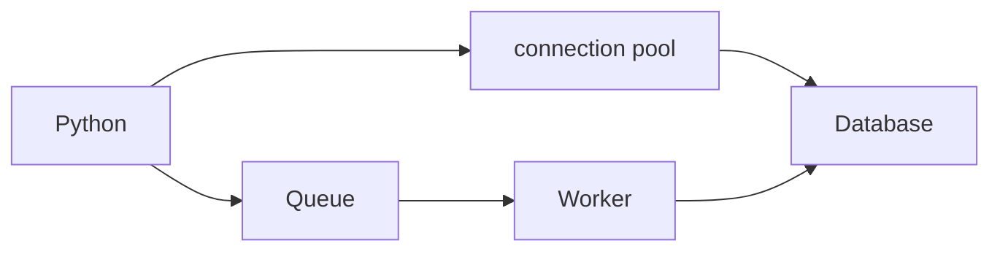

# Python with Databases and Distributed Systems

> Networked data operations are partial, delayed, duplicated, and concurrent; correctness must account for all four.

Study [safe access](junior.md), [transactions and idempotency](middle.md), [distributed invariants](senior.md), and [data-platform governance](professional.md).
