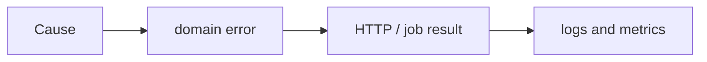

# Python Error Handling

> Preserve enough failure meaning for the correct layer to recover, translate, or stop.

Move from [narrow exception handling](junior.md) to [boundary translation](middle.md), [failure contracts](senior.md), and [organizational reliability policy](professional.md). Practice by testing one success, permanent failure, transient failure, and cancellation.
