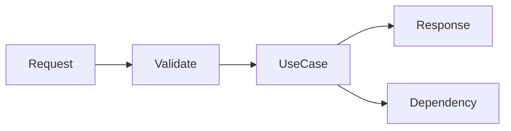

# Python HTTP APIs

> An API is a versioned behavior contract with validation, failure semantics, limits, and operational evidence.

Study [endpoint fundamentals](junior.md), [thin transport boundaries](middle.md), [evolution and resilience](senior.md), and [API governance](professional.md). Practice with a contract test that includes timeout and invalid-input cases.
