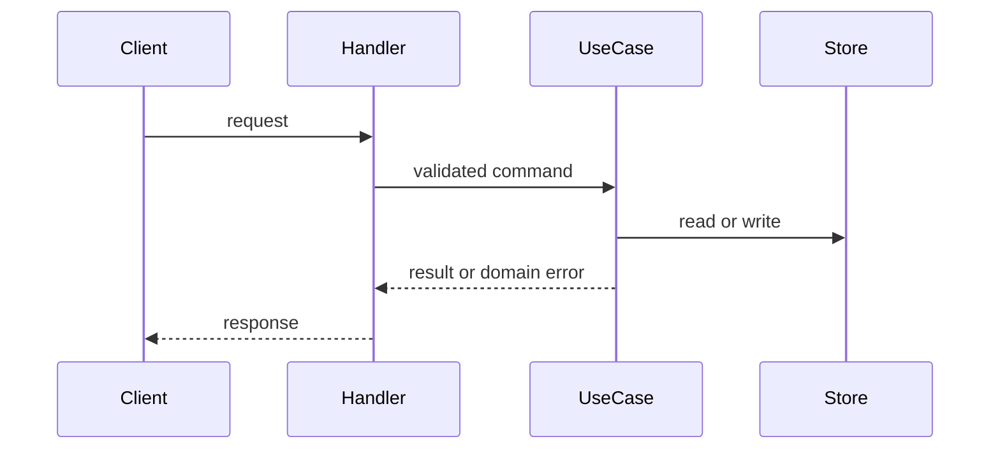

# Python HTTP APIs — Middle

Keep transport code thin:

Use schemas for validation and serialization. Set request timeouts for outbound calls. Paginate collections, authenticate before sensitive work, and make write requests idempotent when clients can retry.
