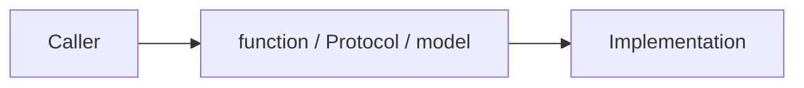

# Python Interfaces

> A good Python interface makes the valid operation obvious and the invalid state difficult to construct.

Progress from [clear functions](junior.md), through [Protocols and models](middle.md), to [cross-team contracts](senior.md) and [shared API governance](professional.md). Practice by replacing one dictionary-shaped boundary with an explicit typed contract.
