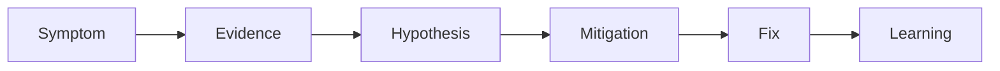

# Python Production Debugging

> Turn a symptom into evidence, one testable hypothesis, a safe mitigation, and a verified fix.

Progress through [tracebacks and reproduction](junior.md), [logs/metrics/traces](middle.md), [system diagnosis](senior.md), and [incident operating models](professional.md). Practice by writing the evidence needed before the next incident.
