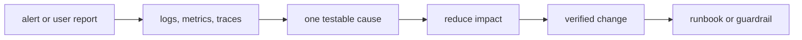

# Python Production Debugging — Senior

Debug production as a system:

Prioritize mitigation and blast-radius control. Use profiles, thread/task dumps, and database evidence only when the symptom points there. Record the invariant that the fix restores.
