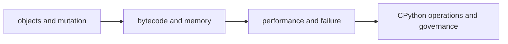

# Python Runtime

> Explain Python behavior through objects, bytecode, allocation, the interpreter, and measured runtime evidence.

| Level | Outcome |
|---|---|
| [Junior](junior.md) | Predict names, values, mutation, and resource lifetime. |
| [Middle](middle.md) | Inspect bytecode, allocations, iterators, and copies. |
| [Senior](senior.md) | Diagnose CPU, memory, startup, and GIL-sensitive workloads. |
| [Professional](professional.md) | Govern interpreter versions and runtime budgets. |

Practice: prove one runtime claim with `dis`, `tracemalloc`, or a profile.
